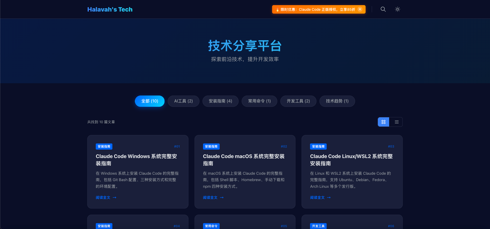

## 📚 项目介绍

**高性能 Next.js 技术博客模板 | 专为中国国内访问优化**

[](https://nextjs.org/)
[](https://www.typescriptlang.org/)
[](https://opensource.org/licenses/MIT)
[](https://online.halavah.us/)
[](https://online.halavah.us/)

[**🌐 在线演示**](https://online.halavah.us/) · [**📖 文档**](./docs/) · [**🐛 报告问题**](https://github.com/halavah/quartz-online/issues) · [**✨ 功能建议**](https://github.com/halavah/quartz-online/issues/new)

*一个现代化、高性能的技术博客模板，内置 Cloudflare CDN 优化，专为中国国内访问设计*



---

## 🚀 快速开始

### 方式一：一键部署到 Vercel (推荐)

点击下方按钮，30 秒完成部署：

[](https://vercel.com/new/clone?repository-url=https://github.com/halavah/quartz-online&project-name=my-tech-blog&repository-name=my-tech-blog)

**部署后的配置**:
1. 自动部署到 Vercel (HKG1 - 香港)
2. 配置自定义域名 (可选)
3. 绑定 Cloudflare CDN (推荐，见[配置指南](./docs/07.Cloudflare优化.md))

### 方式二：一键部署到 Render

点击下方按钮，快速部署到 Render (新加坡节点):

[](https://render.com/deploy?repo=https://github.com/halavah/quartz-online)

**部署后的配置**:
1. 自动部署到 Render (Singapore)
2. 免费套餐可用
3. 自动 HTTPS 证书
4. 支持自定义域名

### 方式三：使用 GitHub Template

1. 点击仓库页面右上角的 **"Use this template"** 按钮
2. 创建你自己的仓库
3. Clone 到本地开始开发

```bash
git clone https://github.com/YOUR_USERNAME/YOUR_REPO_NAME.git
cd YOUR_REPO_NAME
npm install
npm run dev
```

### 方式四：Docker 部署

使用 Docker 快速部署:

```bash
# 方式 1: 使用 Docker Compose (推荐)
docker-compose up -d

# 方式 2: 使用 Docker 命令
docker build -t quartz-online .
docker run -d -p 3000:31200 --name quartz-online quartz-online

# 访问 http://localhost:31200
```

### 方式五：手动部署

```bash
# 1. Clone 项目
git clone https://github.com/halavah/quartz-online.git
cd quartz-online

# 2. 安装依赖
npm install

# 3. 启动开发服务器
npm run dev

# 4. 访问 http://localhost:31200
```

---

## 📁 项目结构

```
quartz-online/
├── app/                          # Next.js App Router
│   ├── [...]htmlFile]/          # 文章动态路由
│   │   ├── page.tsx             # 文章页面 (SSG + HTML预加载)
│   │   └── ArticleIframe.tsx   # iframe 优化组件
│   ├── components/              # 共���组件
│   │   ├── Navbar.tsx           # 导航栏
│   │   ├── Footer.tsx           # 页脚
│   │   └── Pagination.tsx       # 分页
│   ├── page.tsx                 # 首页
│   ├── layout.tsx               # 根布局 (已移除 Google Fonts)
│   └── globals.css              # 全局样式 (系统字体栈)
│
├── data/
│   └── articles.json            # 文章配置文件 ⭐
│
├── public/
│   ├── chapter01/               # 章节 1: 安装指南
│   │   ├── 0101.windows-installation.html
│   │   ├── 0102.macos-installation.html
│   │   ├── 0103.linux-wsl2-installation.html
│   │   └── 0104.claude-code-native-installation.html
│   ├── chapter02/               # 章节 2: 工具介绍
│   │   ├── 0101.xget-high-performance-resource.html
│   │   ├── 0102.bytebot-ai-desktop-agent.html
│   │   ├── 0103.onyx-opensource-ai-platform.html
│   │   ├── 0104.trendradar-trend-monitoring-tool.html
│   │   └── 0105.tracy-profiler-performance-analysis.html
│   └── chapter01_ext/           # Markdown 格式 (可选)
│
├── docs/                        # 项目文档 📚
│   ├── 01.项目总览与快速开始.md
│   ├── 02.开发指南.md
│   ├── 03.内容管理.md
│   ├── 04.部署与运维.md
│   ├── 05.Vercel部署.md
│   ├── 06.HTML书写风格.md
│   └── 07.Cloudflare优化.md  ⭐
│
├── next.config.ts               # Next.js 配置
├── tailwind.config.ts           # Tailwind CSS 配置
├── vercel.json                  # Vercel 部署配置
└── package.json
```

---

## 📝 内容管理

### 添加新文章

#### 1️⃣ 创建 HTML 文件

在 `public/chapter01/` 或 `public/chapter02/` 创建 HTML 文件：

```bash
# 例如：添加新文章
touch public/chapter02/0106.my-new-article.html
```

**HTML 模板示例**:
```html
<!DOCTYPE html>
<html lang="zh-CN">
<head>
    <meta charset="UTF-8">
    <meta name="viewport" content="width=device-width, initial-scale=1.0">
    <title>文章标题</title>
    <style>
        :root {
            --dark-bg: #0a0e27;
            --text-color: #e2e8f0;
            --primary-color: #4c6ef5;
            --border-color: rgba(255, 255, 255, 0.1);
        }
        body {
            background: var(--dark-bg);
            color: var(--text-color);
            font-family: -apple-system, BlinkMacSystemFont, 'Segoe UI', sans-serif;
            max-width: 900px;
            margin: 0 auto;
            padding: 2rem;
        }
        /* 完整样式请参考 docs/06.HTML书写风格.md */
    </style>
</head>
<body>
    <!-- 文章内容 -->
    <div class="hero-header">
        <h1 class="hero-title">文章标题</h1>
        <p class="hero-subtitle">文章副标题</p>
    </div>

    <!-- TOC 导航 -->
    <div class="toc-sidebar">
        <h3>目录</h3>
        <ul>
            <li><a href="#section1">章节 1</a></li>
            <li><a href="#section2">章节 2</a></li>
        </ul>
    </div>

    <!-- 文章正文 -->
    <section id="section1">
        <h2>章节 1</h2>
        <p>内容...</p>
    </section>

    <!-- 返回顶部按钮 -->
    <button class="back-to-top" onclick="window.scrollTo({top:0,behavior:'smooth'})">
        ↑
    </button>
</body>
</html>
```

完整的 HTML 书写规范请参考: [📖 HTML 书写风格指南](./docs/06.HTML书写风格.md)

#### 2️⃣ 更新配置文件

编辑 `data/articles.json`，添加文章元数据：

```json
{
  "config": {
    "siteName": "Halavah's Tech",
    "siteDescription": "探索前沿技术，提升开发效率",
    "githubUrl": "https://github.com/halavah",
    "beianNumber": "京ICP备12345678号",
    "copyrightText": "© 2025 Halavah's Tech. All rights reserved.",
    "adLink": "https://api.nekoapi.com",
    "defaultViewMode": "table"
  },
  "articles": [
    {
      "title": "我的新文章标题",
      "description": "文章简介，详细描述文章内容和亮点",
      "htmlFile": "chapter02/0106.my-new-article.html",
      "category": "AI工具"
    }
  ]
}
```

**🆕 新增功能：首页视图模式配置**

系统支持两种首页文章展示模式，通过 `data/articles.json` 中的 `defaultViewMode` 配置控制：

- **`"table"`** - 表格视图：以表格形式展示文章，信息密度高，适合技术文档类内容
- **`"list"`** - 列表视图：以卡片形式展示文章，视觉效果好，适合博客类内容

```json
{
  "config": {
    // ... 其他配置
    "defaultViewMode": "table"  // 或 "list"
  }
}
```

#### 3️⃣ 预览和部署

```bash
# 本地预览
npm run dev

# 构建
npm run build

# 部署到 Vercel (自动)
git add .
git commit -m "Add new article"
git push
```

---

## 🛠️ 技术栈

<table>
<tr>
<td align="center" width="96">
  
  <br>Next.js
</td>
<td align="center" width="96">
  
  <br>React
</td>
<td align="center" width="96">
  
  <br>TypeScript
</td>
<td align="center" width="96">
  
  <br>Tailwind
</td>
<td align="center" width="96">
  
  <br>Vercel
</td>
<td align="center" width="96">
  
  <br>Cloudflare
</td>
</tr>
</table>

### 核心依赖

```json
{
  "next": "15.5.9",
  "react": "^19.0.0",
  "typescript": "^5.0.0",
  "tailwindcss": "^3.4.0"
}
```

---

## ⚙️ 配置指南

### Render 部署详细步骤

#### 方式 1: 使用 render.yaml 自动部署 (推荐)

1. Fork 本项目到你的 GitHub 账号
2. 访问 [Render Dashboard](https://dashboard.render.com/)
3. 点击 "New" → "Blueprint"
4. 连接你的 GitHub 仓库
5. Render 会自动检测 `render.yaml` 并配置服务
6. 点击 "Apply" 开始部署

#### 方式 2: 手动创建 Web Service

1. 访问 [Render Dashboard](https://dashboard.render.com/)
2. 点击 "New" → "Web Service"
3. 连接你的 GitHub 仓库
4. 配置如下:
   - **Name**: `quartz-online` (或自定义名称)
   - **Region**: `Singapore` (推荐) 或其他地区
   - **Branch**: `master`
   - **Runtime**: `Node`
   - **Build Command**: `npm install && npm run build`
   - **Start Command**: `npm start`
5. 环境变量设置:
   - `NODE_ENV`: `production`
   - `NEXT_TELEMETRY_DISABLED`: `1`
   - `NEXT_PUBLIC_SITE_URL`: 你的域名 (可选)
6. 选择免费套餐 (Free)
7. 点击 "Create Web Service"

**部署完成后**:
- Render 会自动分配一个 `.onrender.com` 域名
- 支持绑定自定义域名 (Settings → Custom Domain)
- 自动配置 HTTPS 证书

### Docker 部署详细步骤

#### 使用 Docker Compose (推荐)

```bash
# 1. 克隆项目
git clone https://github.com/halavah/quartz-online.git
cd quartz-online

# 2. 启动容器
docker-compose up -d

# 3. 查看日志
docker-compose logs -f

# 4. 停止容器
docker-compose down
```

#### 使用 Docker 命令

```bash
# 1. 构建镜像
docker build -t quartz-online .

# 2. 运行容器
docker run -d \
  -p 3000:31200 \
  -e NODE_ENV=production \
  -e NEXT_PUBLIC_SITE_URL=http://localhost:31200 \
  --name quartz-online \
  quartz-online

# 3. 查看日志
docker logs -f quartz-online

# 4. 停止容器
docker stop quartz-online

# 5. 删除容器
docker rm quartz-online
```

#### Docker 生产环境部署

使用 Nginx 反向代理:

```nginx
# /etc/nginx/sites-available/quartz-online
server {
    listen 80;
    server_name your-domain.com;

    location / {
        proxy_pass http://localhost:31200;
        proxy_http_version 1.1;
        proxy_set_header Upgrade $http_upgrade;
        proxy_set_header Connection 'upgrade';
        proxy_set_header Host $host;
        proxy_cache_bypass $http_upgrade;
    }
}
```

```bash
# 启用站点配置
sudo ln -s /etc/nginx/sites-available/quartz-online /etc/nginx/sites-enabled/
sudo nginx -t
sudo systemctl reload nginx

# 使用 Let's Encrypt 配置 HTTPS
sudo certbot --nginx -d your-domain.com
```

### Vercel 部署配置

项目已包含 `vercel.json` 配置文件：

```json
{
  "framework": "nextjs",
  "buildCommand": "npm run build",
  "devCommand": "npm run dev",
  "installCommand": "npm ci",
  "outputDirectory": ".next"
}
```

**部署地区推荐**: Hong Kong (HKG1) - 最适合中国用户访问

### Cloudflare CDN 优化 (强烈推荐)

为了获得最佳的中国国内访问性能，请配置 Cloudflare CDN：

📖 **完整配置指南**: [Cloudflare 中国访问优化配置](./docs/07.Cloudflare优化.md)

**关键配置清单**:
- ✅ DNS 记录设置为 Proxied (橙色云朵)
- ✅ SSL/TLS: Full (strict)
- ✅ Auto Minify: JS, CSS, HTML
- ✅ Brotli 压缩
- ✅ HTTP/3 + 0-RTT
- ✅ Page Rules: HTML 缓存 (1 month)
- ✅ Page Rules: 静态资源缓存 (1 year)

**预期效果**:
```
TTFB: 800ms → 300ms (-60%)
首屏: 3.5s → 1.5s (-60%)
缓存命中率: 90%+
```

### 环境变量 (可选)

网站基本配置在 `data/articles.json` 中设置（见上方"修改网站信息"）。

如需额外的环境变量（如 Google Analytics），可创建 `.env.local` 文件：

```env
# 分析统计 (可选)
NEXT_PUBLIC_GA_ID="G-XXXXXXXXXX"

# 其他自定义环境变量
NEXT_PUBLIC_CUSTOM_VAR="your-value"
```

---

## 🎨 自定义主题

### 修改主题颜色

编辑 `app/globals.css` 中的 CSS 变量：

```css
:root {
  /* 背景色 */
  --dark-bg: #0a0e27;           /* 主背景 */
  --card-bg: #1a1e35;           /* 卡片背景 */

  /* 文字色 */
  --text-color: #e2e8f0;        /* 主文字 */
  --text-secondary: #94a3b8;    /* 次要文字 */

  /* 主题色 */
  --primary-color: #4c6ef5;     /* 主题色 */
  --secondary-color: #7c3aed;   /* 辅助色 */

  /* 边框色 */
  --border-color: rgba(255, 255, 255, 0.1);
}
```

### 修改网站信息

编辑 `data/articles.json`:

```json
{
  "config": {
    "siteName": "你的网站名称",
    "siteDescription": "你的网站描述",
    "githubUrl": "https://github.com/your-username",
    "beianNumber": "京ICP备12345678号",
    "copyrightText": "© 2025 Your Name. All rights reserved.",
    "adLink": "https://your-ad-link.com"
  },
  "articles": [
    // 你的文章配置...
  ]
}
```

---

## 📚 文档

| 文档 | 描述 |
|------|------|
| [项目总览](./docs/01.项目总览与快速开始.md) | 项目概述和快速上手 |
| [开发指南](./docs/02.开发指南.md) | 开发环境配置和开发流程 |
| [内容管理](./docs/03.内容管理.md) | 如何添加和管理文章 |
| [部署与运维](./docs/04.部署与运维.md) | 部署流程和运维指南 |
| [Vercel 部署](./docs/05.Vercel部署.md) | Vercel 平台部署详解 |
| [HTML 书写规范](./docs/06.HTML书写风格.md) | HTML 文章编写标准 |
| [Cloudflare 优化](./docs/07.Cloudflare优化.md) | CDN 性能优化指南 ⭐ |

---

## 🚀 性能优化

### 已实施的优化

#### Phase 1 - 源站优化 ✅
- ✅ 移除 Google Fonts (消除 1-3s 阻塞)
- ✅ 启用 Next.js SSG (TTFB -50%)
- ✅ HTML 预加载 (减少 200-500ms)
- ✅ iframe 加载优化 (3s 超时)

#### Phase 2 - CDN 优化 ✅
- ✅ Brotli 压缩 (体积 -70%)
- ✅ HTTP/3 + 0-RTT (连接时间 -60%)
- ✅ Edge Cache (命中率 90%+)
- ✅ Auto Minify (JS/CSS/HTML)

### 性能测试

```bash
# 测试 TTFB
curl -o /dev/null -s -w "TTFB: %{time_starttransfer}s\n" \
  https://online.halavah.us/

# 测试压缩
curl -H "Accept-Encoding: br" -I https://online.halavah.us/ | grep content-encoding

# 测试缓存
curl -I https://online.halavah.us/ | grep cf-cache-status
```

**在线测试工具**:
- [WebPageTest](https://www.webpagetest.org/) - 选择 "Hong Kong" 节点
- [17CE 网站测速](https://www.17ce.com/) - 中国多地点测试
- [Lighthouse](https://pagespeed.web.dev/) - 性能评分

---

## 🤝 贡献指南

欢迎贡献代码、报告问题或提出建议！

### 贡献流程

1. **Fork 项目**
   ```bash
   # 点击右上角 "Fork" 按钮
   ```

2. **Clone 到本地**
   ```bash
   git clone https://github.com/YOUR_USERNAME/quartz-online.git
   cd quartz-online
   ```

3. **创建功能分支**
   ```bash
   git checkout -b feature/amazing-feature
   ```

4. **提交更改**
   ```bash
   git add .
   git commit -m "Add: 新增某某功能"
   ```

5. **推送到 GitHub**
   ```bash
   git push origin feature/amazing-feature
   ```

6. **创建 Pull Request**
   - 访问你的 Fork 仓库
   - 点击 "New Pull Request"
   - 填写 PR 描述

### 提交规范

遵循 [Conventional Commits](https://www.conventionalcommits.org/) 规范：

```
feat: 新增功能
fix: 修复 Bug
docs: 文档更新
style: 代码格式调整
refactor: 代码重构
perf: 性能优化
test: 测试相关
chore: 构建/工具链相关
```

### 代码风格

项目使用 ESLint 和 Prettier:

```bash
# 检查代码风格
npm run lint

# 自动修复
npm run lint:fix
```

---

## ❓ 常见问题

<details>
<summary><b>Q: 如何更换网站 Logo？</b></summary>

将你的 logo 图片放到 `public/` 目录，然后编辑 `app/components/Navbar.tsx`:

```tsx
<Image src="/your-logo.png" alt="Logo" width={120} height={40} />
```
</details>

<details>
<summary><b>Q: 如何添加 Google Analytics？</b></summary>

1. 在 `.env.local` 添加:
   ```env
   NEXT_PUBLIC_GA_ID="G-XXXXXXXXXX"
   ```

2. 在 `app/layout.tsx` 添加 GA 脚本:
   ```tsx
   <Script src={`https://www.googletagmanager.com/gtag/js?id=${process.env.NEXT_PUBLIC_GA_ID}`} />
   ```
   </details>

<details>
<summary><b>Q: 如何启用评论系统？</b></summary>

推荐使用 [giscus](https://giscus.app/) (基于 GitHub Discussions):

1. 访问 https://giscus.app/ 配置
2. 将生成的代码添加到文章页面组件
3. 支持 Markdown、表情符号、代码高亮
</details>

<details>
<summary><b>Q: 部署后样式错乱？</b></summary>

检查以下配置:

1. `next.config.ts` 中 `trailingSlash: true`
2. Vercel 部署地区选择 HKG1 (Hong Kong)
3. 清除浏览器缓存和 Cloudflare 缓存
</details>

<details>
<summary><b>Q: 如何提升 SEO？</b></summary>

1. 在 `app/layout.tsx` 添加 `<meta>` 标签
2. 生成 `sitemap.xml` 和 `robots.txt`
3. 使用语义化 HTML 标签
4. 添加 JSON-LD 结构化数据
5. 提交到 Google Search Console
</details>

---

## 🌟 Star History

如果这个项目对你有帮助，请给一个 ⭐ Star 支持一下！

[](https://star-history.com/#halavah/quartz-online&Date)
