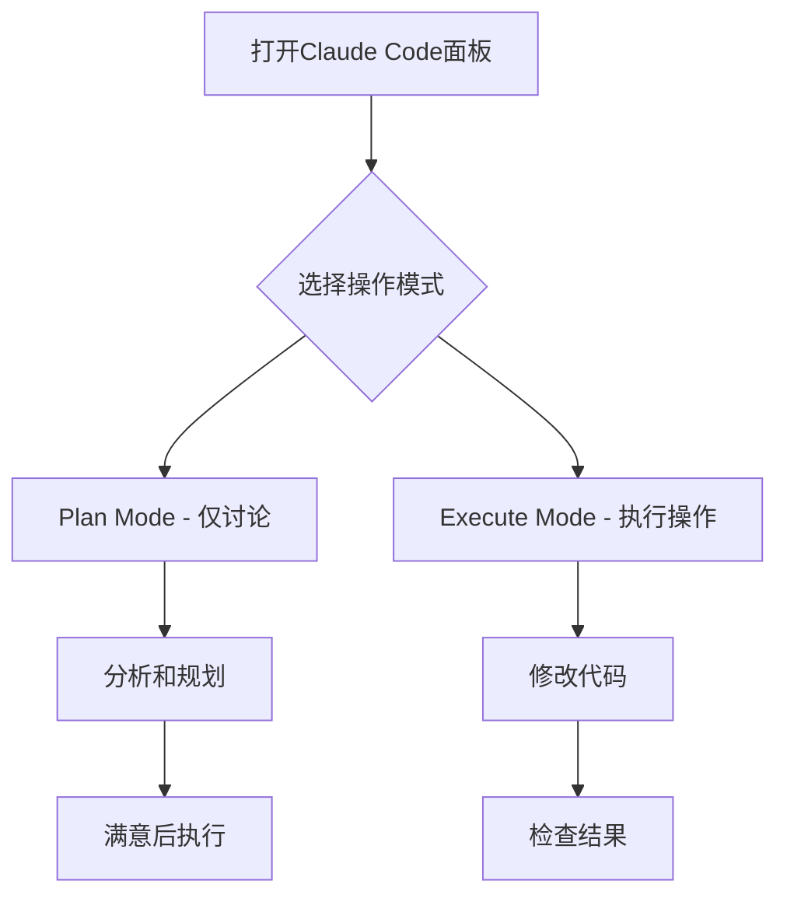

# Claude Code Advanced Usage - 高级使用技巧

> 基于实际使用经验，介绍Claude Code的高级功能和实用技巧，让AI编程助手发挥最大效能

## 📋 目录

1. [Claude Code Chat 插件](#1-claude-code-chat-插件)
2. [高级功能配置](#2-高级功能配置)
3. [模型模式选择](#3-模型模式选择)
4. [权限管理](#4-权限管理)
5. [检查点功能](#5-检查点功能)
6. [MCP服务器配置](#6-mcp服务器配置)
7. [常见问题解决](#7-常见问题解决)

## 1. Claude Code Chat 插件

### 核心功能介绍

Claude Code Chat 是VS Code和Cursor的官方插件，提供优雅的聊天界面完成所有AI编程交互。

#### ✨ 主要优势

- **无需终端**：告别命令行操作，界面化交互
- **恢复检查点**：随时撤销更改，回溯历史版本
- **MCP支持**：内置Model Context Protocol服务器管理
- **对话历史**：自动保存全部会话记录
- **IDE深度集成**：完美适配主题和侧边栏

#### ⚠️ 当前限制

- **单任务限制**：无法同时运行多个并行任务
- **功能bug**：部分功能存在稳定性问题
- **Sub Agents**：暂不支持最新Sub Agents功能

### 安装和使用

#### 安装步骤

1. **打开VS Code/Cursor**
2. **搜索插件**：在扩展市场搜索"Claude Code"
3. **点击安装**：安装官方Claude Code插件
4. **配置认证**：输入Anthropic API密钥

#### 界面操作



## 2. 高级功能配置

### 模型模式选择

Claude Code提供多种思考模式，根据任务复杂度选择：

| 模式 | 适用场景 | 消耗 | 建议 |
|------|----------|------|------|
| Think | 简单任务，快速响应 | 低 | 日常代码格式化、简单bug |
| Think Hard | 中等复杂度任务 | 中 | API设计、功能开发 |
| Think Harder | 复杂任务，深度思考 | 高 | 系统架构、算法实现 |
| Ultrathink | 创新性任务 | 极高 | 前沿技术探索、复杂问题 |

#### 使用示例

```bash
# 基础模式（默认）
/model think

# 深度思考模式
/model think-hard

# 极限思考模式（无预算限制）
/model ultrathink
```

### 界面个性化

#### 主题和布局

在VS Code设置中可以配置：

```json
{
  "claude-code.theme": "dark",
  "claude-code.fontSize": 14,
  "claude-code.showLineNumbers": true,
  "claude-code.autoSave": true
}
```

## 3. 权限管理

### Yolo Mode（自动授权）

#### 启用方式

**方法1：设置界面**
- 点击右上角设置图标
- 找到"Enable Yolo Mode"
- 开启自动权限授权

**方法2：命令行**
```bash
# 启动时自动授权所有权限
claude --dangerously-skip-permissions

# 设置别名简化使用
alias ai="claude --dangerously-skip-permissions"
```

#### 安全建议

- ✅ **推荐场景**：信任的开发环境，熟悉的项目
- ❌ **避免场景**：生产环境，不熟悉的代码库
- ⚠️ **注意风险**：自动授权可能导致意外修改

### 权限级别说明

| 级别 | 描述 | 适用场景 |
|------|------|----------|
| 标准 | 每次操作需要确认 | 重要的生产项目 |
| Yolo | 自动授权所有权限 | 个人开发环境 |
| 自定义 | 选择性授权 | 特定需求场景 |

## 4. 检查点功能

### 检查点类型

#### 1. 自动检查点
- **触发时机**：文件修改前、复杂任务完成时、错误发生时
- **保存内容**：当前工作区状态、会话上下文
- **自动清理**：保留最近50个检查点

#### 2. 手动检查点
```bash
# 创建命名检查点
/checkpoint create "before-refactor"

# 列出所有检查点
/checkpoint list

# 恢复到特定检查点
/checkpoint restore "before-refactor"

# 删除检查点
/checkpoint delete "old-checkpoint"
```

### 智能恢复

#### 上下文感知恢复
```bash
# 自然语言描述恢复
/restore "刚才的数据库性能优化"
/restore "一个小时前的登录功能开发"
/restore "before breaking change"
```

#### 时间范围恢复
```bash
# 按时间范围恢复
/restore "last 2 hours"
/restore "yesterday morning"
/restore "before last commit"
```

## 5. MCP服务器配置

### MCP管理界面

#### 访问方式
1. **界面按钮**：点击对话框下方的'MCP'按钮
2. **命令访问**：使用`/mcp open`命令

#### 推荐服务器

基于官方建议，建议安装以下MCP服务器：

**核心工具**
- `@modelcontextprotocol/server-filesystem` - 文件系统操作
- `@modelcontextprotocol/server-github` - GitHub集成
- `@modelcontextprotocol/server-fetch` - 网络请求
- `@modelcontextprotocol/server-shell` - Shell命令

**专业工具**
- `@modelcontextprotocol/server-postgres` - PostgreSQL数据库
- `@modelcontextprotocol/server-puppeteer` - 网页自动化

### 安装方式

#### 批量安装推荐服务器
```bash
# 一键安装官方推荐服务器
/mcp install-recommended

# 手动安装特定服务器
/mcp install filesystem github fetch shell

# 验证安装
/mcp list
/mcp status
```

#### 配置示例
```yaml
# .claude/mcp-config.yaml
servers:
  filesystem:
    enabled: true
    root_path: "./"
    exclude_patterns: ["node_modules/**", ".git/**"]

  github:
    enabled: true
    token: "${GITHUB_TOKEN}"

  fetch:
    enabled: true
    timeout: 30
    max_retries: 3
```

## 6. 常见问题解决

### 问题1：响应速度慢

#### 解决方案
```bash
# 启用性能优化
/performance enable

# 清理缓存
/cache clear

# 调整模型模式
/model think  # 而不是 think-harder
```

### 问题2：检查点恢复失败

#### 诊断步骤
```bash
# 检查检查点状态
/diagnose checkpoints

# 修复损坏的检查点
/repair checkpoints

# 重建索引
/rebuild index
```

### 问题3：MCP连接问题

#### 排查方法
```bash
# 检查MCP状态
/mcp status

# 测试连接
/mcp test-connection

# 重新配置
/mcp reconfigure
```

## 7. 实用技巧

### 效率提升技巧

#### 1. 快捷键配置
- `Ctrl+Shift+P`：打开命令面板
- `Ctrl+Shift+C`：创建检查点
- `Ctrl+Shift+R`：恢复检查点

#### 2. 别名设置
```bash
# 有用的别名设置
alias claude="claude --dangerously-skip-permissions"
alias cc="claude code"
alias ccheck="claude checkpoint create"
alias crestore="claude checkpoint restore"
```

#### 3. 工作区模板
为不同类型的项目创建工作区模板：

```yaml
# .claude/workspace-template.yaml
react_app:
  context_files:
    - "src/**"
    - "public/**"
    - "package.json"

  exclude_patterns:
    - "node_modules/**"
    - "dist/**"

  preferred_model: "think-hard"
  auto_checkpoint: true
```

### 团队协作建议

#### 1. 共享配置
- 统一的MCP服务器配置
- 标准化的检查点策略
- 一致的权限管理规则

#### 2. 最佳实践
- 定期备份重要检查点
- 使用有意义的检查点名称
- 建立代码审查流程
- 定期清理无用的检查点

## 总结

Claude Code Advanced Usage 提供了强大的功能和灵活的配置选项。通过合理使用这些高级功能，可以显著提升AI编程辅助的效率：

### 🎯 核心要点

1. **插件优势**：界面化操作，无需命令行
2. **模式选择**：根据任务复杂度选择合适的思考模式
3. **权限管理**：合理使用Yolo Mode，平衡效率和安全
4. **检查点功能**：定期保存状态，支持快速回滚
5. **MCP集成**：扩展功能，支持更多开发场景

### 🚀 下一步

尝试配置和使用这些高级功能，根据实际需求调整设置，让Claude Code成为更强大的编程助手。