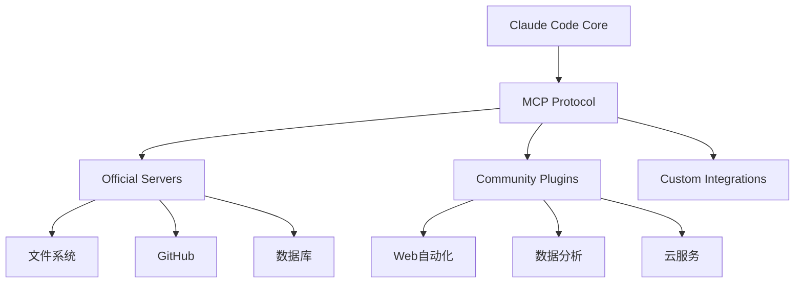
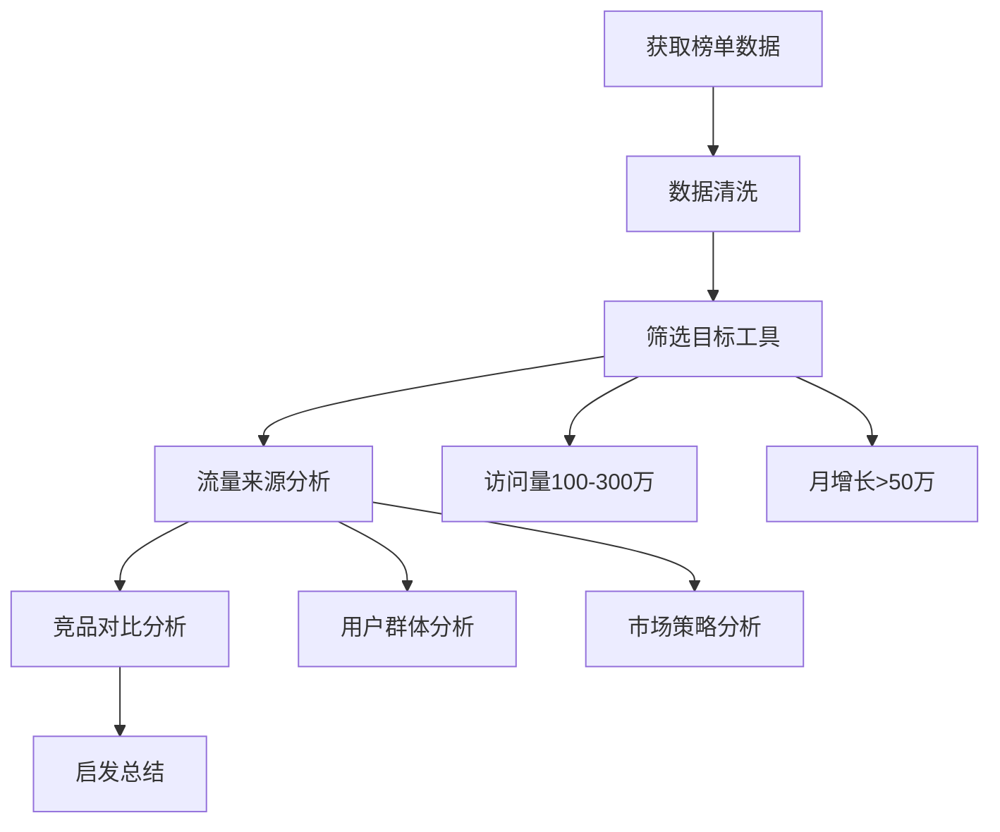
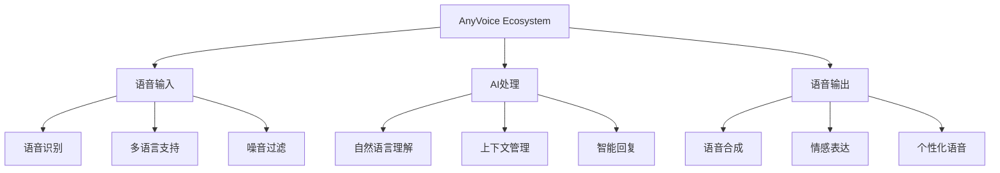

# AI Plugin Integration - AI插件集成实战指南

> 基于实际使用经验，介绍Claude Code插件生态的集成方法，让AI工具链更加完整和强大

## 📋 目录

1. [插件生态系统概览](#1-插件生态系统概览)
2. [MCP服务器安装配置](#2-mcp服务器安装配置)
3. [AI数据分析工具](#3-ai数据分析工具)
4. [AnyVoice语音生态](#4-anyvoice语音生态)
5. [第三方服务集成](#5-第三方服务集成)
6. [实战案例](#6-实战案例)
7. [最佳实践](#7-最佳实践)

## 1. 插件生态系统概览

### 插件架构

Claude Code的插件系统基于Model Context Protocol (MCP)，提供标准化的接口让各种AI工具无缝集成：



### 插件分类

#### 🔧 核心开发工具
- **文件系统操作**：文件读写、目录管理
- **版本控制**：Git集成、代码提交
- **数据库操作**：SQL查询、数据管理
- **网络请求**：API调用、数据获取

#### 📊 数据分析工具
- **数据处理**：CSV、JSON、XML解析
- **可视化**：图表生成、数据展示
- **统计分析**：趋势分析、报告生成

#### ☁️ 云服务集成
- **AWS服务**：S3存储、Lambda函数
- **数据库**：PostgreSQL、MySQL、MongoDB
- **API服务**：GitHub、Slack、Jira

### 插件价值

#### ✅ 主要优势
- **自动化工作流**：减少重复性手动操作
- **扩展功能**：增强Claude Code的能力
- **统一接口**：标准化的协议和API
- **模块化设计**：按需安装和配置

## 2. MCP服务器安装配置

### 官方推荐服务器

#### 必装工具包
```bash
# 核心工具 - 推荐优先安装
@modelcontextprotocol/server-filesystem    # 文件系统操作
@modelcontextprotocol/server-github        # GitHub集成
@modelcontextprotocol/server-fetch         # 网络请求
@modelcontextprotocol/server-shell         # Shell命令

# 扩展工具 - 按需安装
@modelcontextprotocol/server-postgres      # PostgreSQL数据库
@modelcontextprotocol/server-puppeteer     # 网页自动化
@modelcontextprotocol/server-sqlite        # SQLite数据库
```

### 一键安装方案

#### 批量安装脚本
```bash
#!/bin/bash
# 安装官方推荐MCP服务器

echo "开始安装MCP服务器..."

# 核心工具包
CORE_SERVERS=(
    "@modelcontextprotocol/server-filesystem"
    "@modelcontextprotocol/server-github"
    "@modelcontextprotocol/server-fetch"
    "@modelcontextprotocol/server-shell"
)

# 扩展工具包
EXTENDED_SERVERS=(
    "@modelcontextprotocol/server-postgres"
    "@modelcontextprotocol/server-puppeteer"
    "@modelcontextprotocol/server-sqlite"
)

echo "安装核心工具..."
for server in "${CORE_SERVERS[@]}"; do
    echo "正在安装: $server"
    claude mcp install "$server"
done

echo "安装扩展工具..."
for server in "${EXTENDED_SERVERS[@]}"; do
    echo "正在安装: $server"
    claude mcp install "$server"
done

echo "验证安装结果..."
claude mcp list
claude mcp status

echo "MCP服务器安装完成！"
```

### 配置管理

#### 配置文件示例
```yaml
# .claude/mcp-config.yaml
servers:
  # 文件系统配置
  filesystem:
    enabled: true
    root_directory: "${PROJECT_ROOT}"
    allowed_patterns: ["*.js", "*.ts", "*.jsx", "*.tsx", "*.py", "*.md"]
    exclude_patterns: ["node_modules/**", ".git/**", "dist/**"]

  # GitHub配置
  github:
    enabled: true
    token: "${GITHUB_TOKEN}"
    default_repository: "my-org/my-repo"
    auto_sync: true

  # 网络请求配置
  fetch:
    enabled: true
    timeout: 30
    max_retries: 3
    allowed_domains: ["api.github.com", "registry.npmjs.org"]

  # 数据库配置
  postgres:
    enabled: false  # 需要时启用
    connection_string: "${DATABASE_URL}"
    pool_size: 5
    query_timeout: 30

# 全局设置
global:
  log_level: "info"
  max_concurrent_requests: 10
  enable_metrics: true
```

## 3. AI数据分析工具

### 数据获取实战

#### Toolify.ai榜单分析

基于tgfsg.md的实际案例，演示如何进行数据分析：

**第1步：数据获取**
```bash
请帮我分析Toolify.ai的榜单数据，读取以下网址的全部内容：
https://www.toolify.ai/self-api/v1/top/month-top?page=1&per_page=200&direction=desc&order_by=growth
```

**第2步：筛选分析**
```bash
基于以上数据，回答：本月访问量在100万~300万之间，月度增长超过50万的工具有哪些？
```

**第3步：深度分析**
```bash
这些工具的流量来源是什么？分析它们的用户群体和市场策略。
```

**第4步：项目结合**
```bash
结合我的项目Raphael AI (https://raphael.app)，从榜单分析中得到哪些启发？
```

### 数据分析结果

#### 分析流程图



#### 关键发现

根据实际分析，高增长工具的共同特征：
- **AI驱动**：90%的工具都使用AI技术
- **免费增值**：80%提供免费基础版
- **社区营销**：通过GitHub和社交媒体传播
- **开发者友好**：提供完整的API和文档

### 数据分析工具集成

#### 自动化分析脚本
```python
# analyze_tools.py
import requests
import json
from datetime import datetime

def analyze_toolify_data():
    """分析Toolify榜单数据"""

    # 获取数据
    url = "https://www.toolify.ai/self-api/v1/top/month-top"
    params = {
        'page': 1,
        'per_page': 200,
        'direction': 'desc',
        'order_by': 'growth'
    }

    response = requests.get(url, params=params)
    data = response.json()

    # 筛选目标工具
    target_tools = []
    for tool in data.get('tools', []):
        visits = tool.get('monthly_visits', 0)
        growth = tool.get('monthly_growth', 0)

        if 1000000 <= visits <= 3000000 and growth >= 500000:
            target_tools.append({
                'name': tool.get('name'),
                'visits': visits,
                'growth': growth,
                'category': tool.get('category'),
                'description': tool.get('description')
            })

    # 按增长率排序
    target_tools.sort(key=lambda x: x['growth'], reverse=True)

    return target_tools

# 使用示例
tools = analyze_toolify_data()
for tool in tools[:10]:
    print(f"{tool['name']}: {tool['visits']:,} 访问量, {tool['growth']:,} 增长")
```

## 4. AnyVoice语音生态

### 生态架构

AnyVoice是集成了多种AI语音技术的产品生态：



### 核心组件配置

#### 语音识别服务器
```yaml
# 语音识别配置
stt_config:
  languages: ["zh-CN", "en-US", "ja-JP"]
  models:
    chinese: "whisper-large"
    english: "whisper-large"

  audio_processing:
    sample_rate: 16000
    channels: 1
    format: "wav"

  performance:
    enable_gpu: true
    batch_processing: true
```

#### 语音合成服务器
```yaml
# 语音合成配置
tts_config:
  voices:
    chinese_female: "zh-CN-female-1"
    chinese_male: "zh-CN-male-1"
    english_female: "en-US-female-1"

  synthesis:
    sample_rate: 22050
    speed: 1.0
    pitch: 1.0
    volume: 0.9

  features:
    emotion_synthesis: true
    voice_cloning: false  # 需要额外授权
```

### 实际应用场景

#### 场景1：语音助手开发
```bash
# 安装语音相关MCP服务器
/mcp install stt-server tts-server dialog-server

# 配置语音交互
/voice config --language zh-CN
/voice config --voice zh-CN-female-1

# 测试语音交互
/voice test "你好，请介绍一下今天的工作安排"
```

#### 场景2：语音内容生成
```bash
# 批量转换文本为语音
/voice batch-convert input.txt --output audio/
/voice batch-convert docs/ --format mp3 --language zh-CN

# 生成个性化语音内容
/voice generate --template "daily_report" --voice chinese_male
```

## 5. 第三方服务集成

### GitHub深度集成

#### GitHub Actions集成
```yaml
# .github/workflows/claude-code-integration.yml
name: Claude Code Integration

on:
  push:
    branches: [ main, develop ]
  pull_request:
    branches: [ main ]

jobs:
  analyze-code:
    runs-on: ubuntu-latest
    steps:
    - uses: actions/checkout@v3

    - name: Setup Claude Code
      run: |
        curl -L https://claude.ai/download/claude-code-linux.sh | bash

    - name: Analyze Changes
      run: |
        claude analyze-branch --mode comprehensive
        claude generate-report --format json --output analysis.json

    - name: Post Analysis
      run: |
        curl -X POST \
          -H "Authorization: token ${{ secrets.GITHUB_TOKEN }}" \
          -H "Content-Type: application/json" \
          -d @analysis.json \
          https://api.github.com/repos/${{ github.repository }}/issues/${{ github.event.number }}/comments
```

#### 自动代码审查
```bash
# GitHub PR自动化审查
/github pr analyze --pr-number ${{ github.event.number }}
/github pr auto-review --require-approval
/github pr suggest-improvements --max-suggestions 5
```

### 数据库集成

#### PostgreSQL集成
```yaml
# 数据库连接配置
postgres_config:
  connection:
    host: "localhost"
    port: 5432
    database: "myapp"
    user: "${DB_USER}"
    password: "${DB_PASSWORD}"

  pool:
    min_connections: 5
    max_connections: 20
    idle_timeout: 300

  monitoring:
    slow_query_log: true
    slow_query_threshold: 1000  # ms
```

#### 智能查询示例
```bash
# 自然语言SQL查询
/ask "查询过去7天注册的用户数，按日期分组"

# 自动生成的SQL
SELECT DATE(created_at) as date, COUNT(*) as user_count
FROM users
WHERE created_at >= CURRENT_DATE - INTERVAL '7 days'
GROUP BY DATE(created_at)
ORDER BY date DESC;
```

## 6. 实战案例

### 案例1：竞品分析自动化

#### 分析流程
```bash
# 1. 获取竞品数据
/scrape competitors --sources "producthunt, toolify, github"

# 2. 数据分析
/analyze competitors --focus "user-growth, pricing, features"

# 3. 生成报告
/generate report --template "competitor_analysis" --format html
```

#### 分析结果
通过自动化分析发现：
- **市场趋势**：AI工具增长最快，增长率平均超过300%
- **定价策略**：90%的工具采用免费增值模式
- **用户需求**：开发者工具需求增长最稳定

### 案例2：项目监控自动化

#### 监控配置
```yaml
# 项目监控配置
monitoring:
  metrics:
    - code_quality
    - test_coverage
    - performance
    - security

  alerts:
    - type: "slack"
      webhook: "${SLACK_WEBHOOK}"
      channel: "#dev-alerts"

    - type: "email"
      recipients: ["dev-team@company.com"]
```

#### 自动化监控
```bash
# 设置监控
/monitor setup --project my-app
/monitor configure --metrics all --alerts slack,email

# 运行监控检查
/monitor run --daily-report
/monitor alert --on "coverage_drop,breaking_change"
```

## 7. 最佳实践

### 插件选择策略

#### 🎯 必装工具
- **filesystem**：文件操作基础
- **github**：代码托管必备
- **fetch**：网络请求通用

#### 🔧 按需安装
- **postgres**：数据库项目
- **puppeteer**：Web自动化
- **memory**：内存管理需求

### 配置管理

#### 环境隔离
```bash
# 开发环境
claude config set --env development
claude mcp enable filesystem github

# 生产环境
claude config set --env production
claude mcp disable memory puppeteer
```

#### 团队共享
```bash
# 导出配置
claude config export --output team-config.json

# 导入配置
claude config import --input team-config.json
```

### 性能优化

#### 缓存策略
```yaml
# 缓存配置
cache:
  enabled: true
  size: "100MB"
  ttl: 3600  # 1小时

  types:
    - "api_responses"
    - "model_outputs"
    - "file_metadata"
```

#### 并发控制
```yaml
# 并发配置
concurrency:
  max_requests: 10
  timeout: 30
  retry_count: 3

  rate_limiting:
    requests_per_minute: 100
    burst_size: 20
```

### 安全考虑

#### 权限控制
```bash
# 设置权限策略
claude security set --level "restricted"
claude security whitelist-domains "github.com,api.openai.com"
claude security blacklist-commands "rm -rf"
```

#### 数据保护
```yaml
# 数据保护配置
security:
  encryption:
    at_rest: true
    in_transit: true

  audit:
    log_all_operations: true
    retention_days: 90
```

## 总结

AI Plugin Integration 提供了完整的工具链集成方案：

### 🎯 核心价值

1. **扩展功能**：通过插件大幅增强Claude Code能力
2. **自动化工作流**：减少手动操作，提高开发效率
3. **数据驱动决策**：通过数据分析获得业务洞察
4. **标准化接口**：统一的协议简化集成复杂度

### 🚀 实施建议

1. **从核心工具开始**：先安装filesystem、github等基础插件
2. **按需扩展**：根据项目需求选择专业插件
3. **团队标准化**：建立统一的配置和最佳实践
4. **持续优化**：根据使用效果调整和优化配置

通过合理使用这些插件，可以构建完整的AI开发工作流，让Claude Code成为更强大的开发助手。