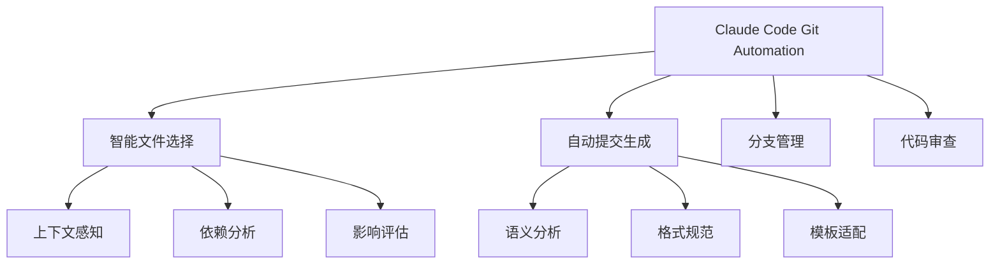
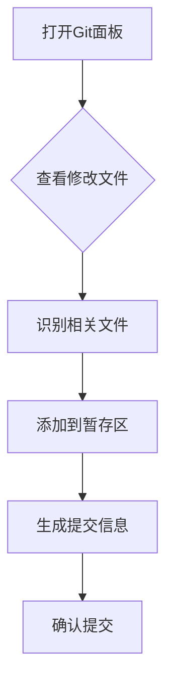
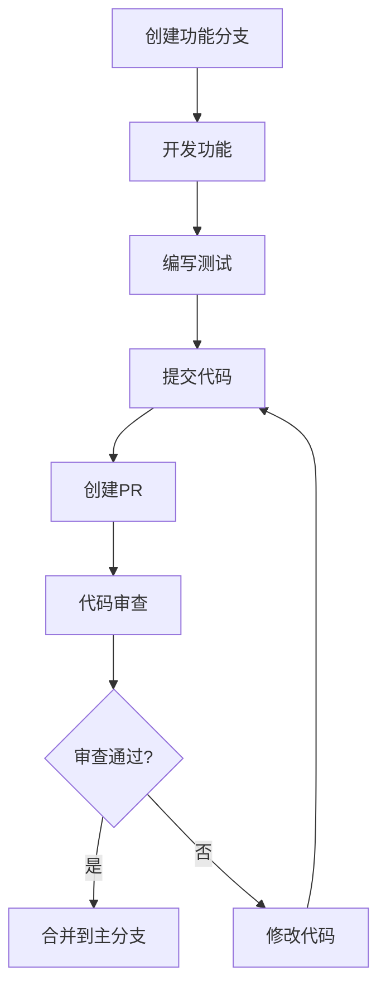

# Git Workflow Automation - Git工作流自动化实战

> 基于实际使用经验，介绍Claude Code的Git工作流自动化功能，让团队协作更高效

## 📋 目录

1. [Git工作流自动化概览](#1-git工作流自动化概览)
2. [两种提交流程对比](#2-两种提交流程对比)
3. [精准文件选择](#3-精准文件选择)
4. [智能提交信息生成](#4-智能提交信息生成)
5. [分支管理自动化](#5-分支管理自动化)
6. [团队协作最佳实践](#6-团队协作最佳实践)
7. [常见问题解决](#7-常见问题解决)

## 1. Git工作流自动化概览

### 传统Git工作流的痛点

#### 😫 常见问题
- **文件选择困难**：在复杂项目中难以精准选择相关文件
- **提交信息不规范**：团队成员提交信息格式不统一
- **分支管理混乱**：缺乏标准化的分支管理策略
- **协作冲突频发**：多人协作时经常出现冲突

#### ✨ 自动化的价值
- **提升效率**：减少重复性手动操作
- **规范流程**：统一团队的工作标准
- **降低错误**：减少人为操作失误
- **改善协作**：优化团队协作体验

### Claude Code的自动化能力

#### 核心功能


## 2. 两种提交流程对比

### 方式1：界面操作流程

#### 操作步骤

**第1步：文件状态检查**
- 在VS Code的Changes区域查看所有修改的文件
- 识别本次功能相关的文件

**第2步：精准添加文件**
- 点击相关文件右侧的"+"号添加到暂存区
- 确认Staged Changes区域包含正确的文件

**第3步：生成提交信息**
- 点击"源代码管理"标签
- 点击"智能生成提交信息"按钮或使用快捷键`Ctrl+Enter`

**第4步：确认和提交**
- 检查生成的提交信息
- 点击"提交"按钮完成提交

#### 界面示例



### 方式2：Claude Code自动化

#### 前置条件
```bash
# 开启Bypass permission模式
claude --dangerously-skip-permissions

# 或者使用别名
alias ai="claude --dangerously-skip-permissions"
```

#### 自动化提交
```bash
# 让Claude Code自动提交
请帮我提交代码，只提交和本次修改内容有关的文件，提交记录写规范点，用中文

# Claude Code的执行过程：
# 1. 分析当前Git状态
# 2. 识别功能相关的文件
# 3. 自动将相关文件添加到暂存区
# 4. 生成规范的提交信息
# 5. 执行提交操作
```

#### 执行效果
```bash
# Claude Code自动执行类似以下命令：
git add src/components/UserAuth.js
git add src/services/authService.js
git add tests/auth.test.js
git commit -m "feat: 添加用户认证功能

- 实现登录表单组件
- 新增认证服务接口
- 添加单元测试用例"
```

### 两种方式对比

| 特性 | 界面操作 | Claude Code自动化 |
|------|----------|-------------------|
| **控制度** | 完全控制 | 自动化执行 |
| **速度** | 手动操作，较慢 | 一键执行，快速 |
| **准确性** | 依赖人工判断 | AI辅助，更准确 |
| **学习成本** | 简单直观 | 需要信任AI |
| **适用场景** | 重要提交、谨慎操作 | 日常提交、快速迭代 |

## 3. 精准文件选择

### 可视化文件选择方法

#### VS Code界面操作
```
Git状态面板
├── Changes (未暂存文件)
│   ├── ✅ src/components/UserAuth.js          [+]     ← 相关文件，点击+添加
│   ├── ✅ src/services/authService.js        [+]     ← 相关文件，点击+添加
│   ├── ✅ tests/auth.test.js                  [+]     ← 相关文件，点击+添加
│   ├── ❌ config/dev.env                     [+]     ← 无关文件，不添加
│   ├── ❌ package-lock.json                  [+]     ← 无关文件，不添加
│   └── ❌ .gitignore                          [+]     ← 无关文件，不添加
│
└── Staged Changes (已暂存文件)
    ├── src/components/UserAuth.js
    ├── src/services/authService.js
    └── tests/auth.test.js
```

#### 选择策略

#### ✅ 推荐选择原则
1. **功能相关**：选择与当前功能直接相关的文件
2. **测试覆盖**：包含相应的测试文件
3. **文档更新**：包含相关文档的修改
4. **配置变更**：只有在功能需要时选择配置文件

#### ❌ 避免选择的文件
- **依赖文件**：package-lock.json、yarn.lock
- **临时文件**：.tmp、*.log
- **编辑器配置**：.vscode/settings.json
- **不相关的配置**：与本次功能无关的环境配置

### 智能文件选择技巧

#### 基于功能模块识别
```bash
# 通过功能描述识别相关文件
功能：用户认证登录
相关文件：src/auth/**、src/components/Login/**、tests/auth/**

功能：数据库性能优化
相关文件：src/db/**、migrations/**、config/database.js
```

#### 批量选择技巧
```bash
# 使用通配符批量选择
git add src/**/*auth*
git add tests/*test*
git add docs/api-*.md

# 排除特定文件
git add src/ -- ':!config/*' ':!*.env'
```

## 4. 智能提交信息生成

### 提交信息格式标准

#### 规范格式
```
<type>(<scope>): <description>

<body>

<footer>
```

#### 常用类型
| 类型 | 说明 | 示例 |
|------|------|------|
| `feat` | 新功能 | `feat(auth): 添加用户登录功能` |
| `fix` | Bug修复 | `fix(api): 修复用户查询接口错误` |
| `docs` | 文档更新 | `docs(readme): 更新安装说明` |
| `style` | 代码格式 | `style(format): 统一代码缩进` |
| `refactor` | 重构 | `refactor(auth): 重构认证服务结构` |
| `test` | 测试相关 | `test(auth): 添加认证服务单元测试` |
| `chore` | 构建工具 | `chore(deps): 更新依赖包版本` |

### Claude Code智能生成

#### 生成示例

**场景1：新功能开发**
```bash
# 提交内容：
- 新增用户登录表单组件
- 实现认证服务
- 添加登录接口
- 编写相关测试

# Claude Code生成的提交信息：
feat(auth): 添加用户认证功能

- 实现登录表单UI组件
- 新增用户认证服务接口
- 集成JWT token验证
- 添加登录状态管理
- 完善单元测试用例
```

**场景2：Bug修复**
```bash
# 提交内容：
- 修复用户查询接口分页错误
- 调整SQL查询逻辑

# Claude Code生成的提交信息：
fix(api): 修复用户查询接口分页错误

- 修正分页参数传递错误
- 优化SQL查询性能
- 添加边界条件检查
- 更新相关测试用例
```

### 提交信息质量提升

#### ✅ 优质提交信息特征
- **简洁明了**：一句话概括变更内容
- **信息完整**：包含变更范围和原因
- **便于搜索**：使用有意义的关键词
- **格式规范**：遵循团队约定格式

#### 🔧 提升技巧
1. **先描述，后提交**：先告诉Claude要做什么，再让其生成提交信息
2. **提供上下文**：说明功能背景和目的
3. **指定格式**：可以指定特定的格式要求

## 5. 分支管理自动化

### 分支命名规范

#### 标准命名模式
```
feature/功能描述           # 功能开发分支
bugfix/问题描述           # Bug修复分支
hotfix/紧急修复描述        # 紧急修复分支
release/版本号            # 发布分支
experimental/实验性功能    # 实验性分支
```

#### 示例
```bash
feature/user-authentication
bugfix/login-validation-error
hotfix/security-vulnerability
release/v1.2.0
experimental/ai-chat-integration
```

### 智能分支操作

#### 自动创建分支
```bash
# 基于功能描述自动创建分支
请为"用户登录功能"创建功能分支

# Claude Code执行：
git checkout -b feature/user-authentication develop
git push -u origin feature/user-authentication
```

#### 智能合并分支
```bash
# 智能合并分支，处理冲突
请将feature/user-authentication分支合并到develop分支

# Claude Code执行：
git checkout develop
git pull origin develop
git merge feature/user-authentication --no-ff
git push origin develop

# 如有冲突，会提示手动解决
```

### 分支保护策略

#### 主分支保护
```yaml
# 主分支保护规则
main_branch:
  require_reviews: 2          # 需要2个审查
  require_tests_pass: true   # 需要测试通过
  require_up_to_date: true    # 需要是最新的
  force_push: false         # 禁止强制推送
  deletion: false           # 禁止删除
```

## 6. 团队协作最佳实践

### 团队Git规范

#### 统一的工作流程


#### 代码审查Checklist

##### 👀 审查要点
- [ ] **代码质量**：代码可读性、结构清晰
- [ ] **功能正确**：功能实现符合需求
- [ ] **测试覆盖**：有充分的测试用例
- [ ] **性能考虑**：没有明显的性能问题
- [ ] **安全性**：没有安全漏洞
- [ ] **文档更新**：相关文档已更新

### 协作技巧

#### 并行开发策略
```bash
# 1. 使用功能分支隔离开发
git checkout -b feature/user-management develop
git checkout -b feature/product-catalog develop

# 2. 定期同步主分支
git checkout feature/user-management
git pull origin develop

# 3. 解决冲突后继续开发
git merge develop --no-ff
# 解决冲突...
git add .
git commit -m "sync with develop"
```

#### 冲突预防
- **频繁同步**：定期从主分支同步代码
- **小步提交**：保持提交粒度较小
- **及时沟通**：重要变更提前沟通
- **代码审查**：Pull Request及时审查

## 7. 常见问题解决

### 问题1：文件选择不准确

#### 解决方案
```bash
# 手动精确选择
# 在VS Code界面中逐个点击文件添加到暂存区

# 使用命令行精确选择
git add src/components/UserAuth.js
git add src/services/authService.js

# 使用排除模式
git add src/ -- ':!config/*' ':!*.tmp'
```

### 问题2：提交信息不符合规范

#### 解决方案
```bash
# 手动编辑提交信息
git commit --amend -m "feat(auth): 添加用户认证功能"

# 或者重新提交
git reset HEAD~1  # 撤销最后一次提交
# 重新选择文件和提交
```

### 问题3：分支冲突

#### 解决方案
```bash
# 1. 查看冲突文件
git status

# 2. 手动解决冲突
# 编辑冲突文件，保留需要的代码
# 删除冲突标记 <<<<<<< ======= >>>>>>>

# 3. 标记冲突已解决
git add .

# 4. 完成合并
git commit
```

### 问题4：权限不足

#### 解决方案
```bash
# 检查权限
git remote -v

# 配置权限
git remote set-url origin git@github.com:user/repo.git

# 使用SSH密钥
ssh-keygen -t rsa -b 4096 -C "your-email@example.com"
# 将公钥添加到GitHub设置
```

## 实用工具和技巧

### Git别名设置
```bash
# 设置有用的Git别名
git config --global alias.co checkout
git config --global alias.br branch
git config --global alias.ci commit
git config --global alias.st status
git config --global alias.unstage 'reset HEAD --'
git config --global alias.last 'log -1 HEAD'
git config --global alias.visual '!gitk'
```

### 快捷键配置
```bash
# Claude Code快捷键
Ctrl+Shift+C    # 创建检查点
Ctrl+Shift+R    # 恢复检查点
Ctrl+Enter      # 生成提交信息

# VS Code Git快捷键
Ctrl+Shift+G    # 打开Git面板
Alt+Left/Right  # 在Git历史中导航
Ctrl+Enter      # 签名提交
```

### 团队配置模板

#### 仓库配置文件
```bash
# .gitconfig
[user]
    name = "Your Name"
    email = "your.email@company.com"

[core]
    autocrlf = input
    filemode = false
    editor = "code --wait"

[alias]
    # 提交相关
    amend = commit --amend
    uncommit = reset --soft HEAD~1

    # 分支相关
    branches = branch -a
    this-branch = "!git rev-parse --abbrev-ref HEAD"

    # 日志相关
    graph = log --oneline --graph --decorate --all
    today = log --since=midnight
    week = log --since=1.week.ago
```

## 总结

Git Workflow Automation 通过Claude Code的智能化功能，大幅提升了Git工作流的效率和规范性：

### 🎯 核心优势

1. **智能文件选择**：AI辅助精准选择相关文件
2. **自动提交生成**：规范化提交信息，提高可追溯性
3. **分支管理优化**：自动化分支创建和合并
4. **团队协作改善**：统一工作流程，减少冲突

### 🚀 实施建议

1. **选择合适的方式**：根据团队习惯选择界面操作或自动化
2. **建立规范**：制定团队Git规范和Checklist
3. **培训团队**：确保团队成员了解最佳实践
4. **持续优化**：根据使用效果调整和优化流程

通过合理使用这些自动化功能，团队可以更专注于代码开发本身，让Git管理变得简单高效。