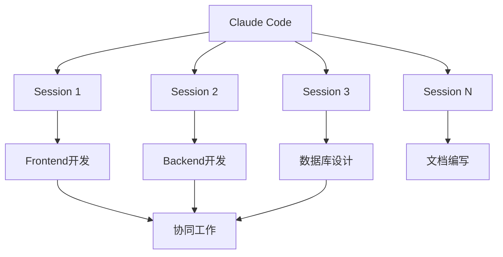
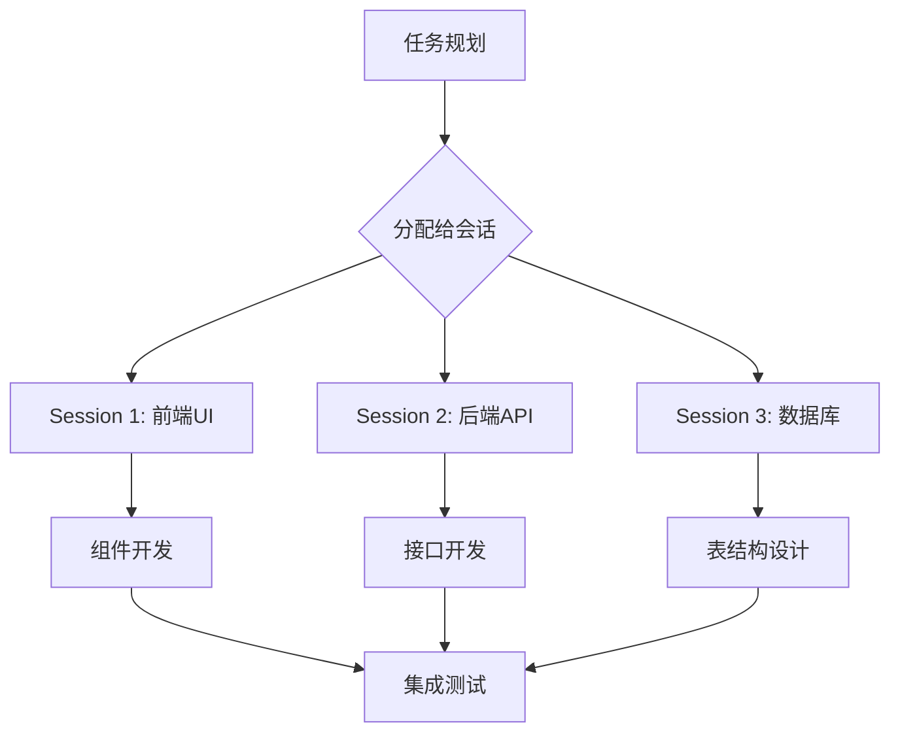
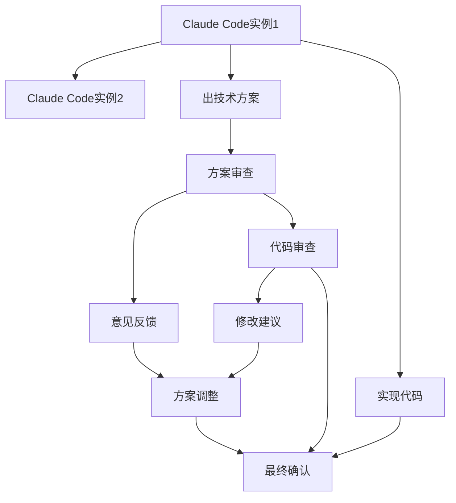
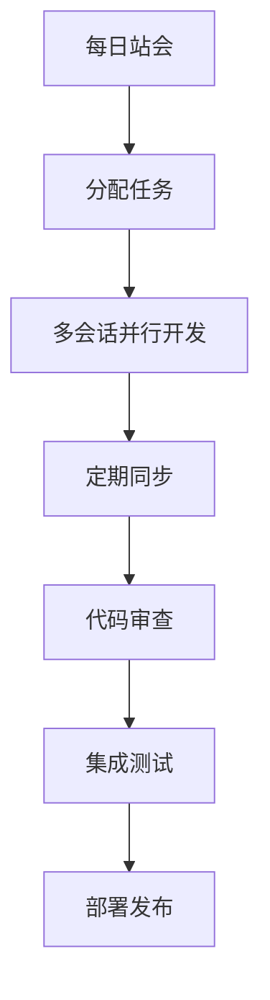

# Multi Session Management - 多会话并行管理策略

> 基于实际使用经验，介绍Claude Code的多会话并行管理方法，让AI开发更加高效

## 📋 目录

1. [多会话管理概述](#1-多会话管理概述)
2. [VS Code多开策略](#2-vs-code多开策略)
3. [Claude Code多实例](#3-claude-code多实例)
4. [会话管理技巧](#4-会话管理技巧)
5. [多会话协作模式](#5-多会话协作模式)
6. [资源优化](#6-资源优化)
7. [最佳实践](#7-最佳实践)

## 1. 多会话管理概述

### 单会话限制

#### 😫 传统开发痛点
- **无法并行处理**：同时只能处理一个任务
- **上下文切换困难**：不同任务间需要频繁切换
- **状态管理复杂**：每个任务的状态需要单独维护
- **效率低下**：串行处理导致时间浪费

#### ✨ 多会话价值
- **并行开发**：同时处理多个功能模块
- **任务隔离**：避免不同任务间的干扰
- **资源优化**：充分利用系统资源
- **专注度提升**：每个会话专注特定任务

### Claude Code的多会话能力

#### 核心功能


## 2. VS Code多开策略

### 基础多开方法

#### 方法1：同一项目多窗口
```bash
# 1. 在VS Code中打开项目
code /path/to/project

# 2. 使用快捷键打开新窗口
Ctrl+Shift+N (Windows/Linux)
Cmd+Shift+N (macOS)

# 3. 在新窗口中打开相同项目
code /path/to/project
```

#### 方法2：分屏显示
```bash
# VS Code分屏快捷键
Ctrl+\ (Windows/Linux)
Cmd+\ (macOS)

# 或使用菜单
View → Editor Layout → Split Editor
```

#### 方法3：标签页管理
```bash
# 拖拽标签页到新窗口
# 右键点击标签页 → Move to New Window
```

### VS Code集成限制

#### ❌ 当前限制
- **IDE连接冲突**：只有一个窗口能与Claude Code保持连接
- **状态同步问题**：不同窗口间状态不同步
- **资源竞争**：多窗口可能导致资源冲突

#### ✅ 解决方案
- **主窗口原则**：保持一个主窗口与Claude Code连接
- **上下文切换**：使用会话切换功能
- **状态隔离**：每个窗口管理各自的状态

## 3. Claude Code多实例

### 多实例启动方法

#### 方法1：命令行启动
```bash
# 启动第一个实例
claude

# 新终端启动第二个实例
claude

# 启动第三个实例
claude --ultrathink  # 高复杂度任务
```

#### 方法2：别名设置
```bash
# 设置不同模式的别名
alias claude="claude --dangerously-skip-permissions"
alias claude_fast="claude --model think"
alias claude_deep="claude --model think-harder"
alias claude_ultra="claude --model ultrathink"

# 使用别名启动
claude_fast      # 快速响应
claude_deep      # 深度思考
claude_ultra      # 极限思考
```

#### 方法3：脚本启动
```bash
#!/bin/bash
# start-claude-sessions.sh

echo "启动Claude Code多实例..."

# 启动不同配置的实例
echo "启动实例1: 前端开发"
terminal --tab -- bash -c "claude --model think-hard" &

echo "启动实例2: 后端开发"
terminal --tab -- bash -c "claude --model think-harder" &

echo "启动实例3: 架构设计"
terminal --tab --bash -c "claude --model ultrathink" &

echo "所有实例已启动"
```

### 实例配置

#### 不同模式配置
```yaml
# .claude/session-configs.yaml
sessions:
  frontend:
    model: "think-hard"
    context_files: ["src/frontend/**", "public/**"]
    auto_save: true

  backend:
    model: "think-harder"
    context_files: ["src/backend/**", "api/**"]
    auto_save: true

  architecture:
    model: "ultrathink"
    context_files: ["docs/**", "architecture/**"]
    auto_save: false

  documentation:
    model: "think"
    context_files: ["docs/**", "README.md"]
    auto_save: true
```

### 实例间协作

#### 会话间信息共享
```bash
# 在会话1中生成代码
echo "生成前端组件代码" > /tmp/session1_task.txt

# 在会话2中引用
/ask "请基于/session1_task.txt的内容生成对应的测试用例"
```

#### 任务分配策略


## 4. 会话管理技巧

### 会话标识和命名

#### 命名策略
```bash
# 会话命名规则
# 格式：项目_模块_任务

session_name="myapp_user-auth_component"

# 具体示例
session_names=(
    "webapp_frontend_login"
    "webapp_backend_auth"
    "webapp_database_users"
    "webapp_api_endpoints"
    "webapp_documentation"
)
```

#### 会话状态管理
```bash
# 查看所有活跃会话
/claude list-sessions

# 切换到特定会话
/claude switch-session "webapp_frontend_login"

# 会话状态保存
/claude save-session --name "webapp_frontend_login"

# 恢复会话状态
/claude load-session --name "webapp_frontend_login"
```

### 上下文管理

#### 项目上下文隔离
```yaml
# 每个会话的项目上下文
session_contexts:
  frontend:
    project_root: "/projects/webapp"
    context_files:
      - "src/frontend/**"
      - "package.json"
      - ".env.frontend"

  backend:
    project_root: "/projects/webapp"
    context_files:
      - "src/backend/**"
      - "api/**"
      - ".env.backend"

  docs:
    project_root: "/projects/webapp"
    context_files:
      - "docs/**"
      - "README.md"
      - "CHANGELOG.md"
```

#### 动态上下文更新
```bash
# 在会话中动态添加文件
/context add src/components/NewComponent.jsx

# 移除不需要的文件
/context remove src/components/OldComponent.jsx

# 查看当前上下文
/context list

# 保存当前上下文配置
/context save --name "frontend-auth"
```

## 5. 多会话协作模式

### 左右互博模式

#### 协作场景


#### 协作命令示例
```bash
# 在实例1中生成方案
请为用户认证功能设计技术方案，包括前后端架构

# 将方案传递给实例2进行审查
请审查以下技术方案，提出改进建议：
[方案内容]

# 在实例2中分析完并给出反馈
这是对技术方案的审查意见：[审查结果]

# 在实例1中根据反馈调整方案
请根据以下审查意见调整技术方案：
[审查意见]
```

### 角色分配模式

#### 专业角色定义
```yaml
# Claude Code角色配置
roles:
  frontend_expert:
    model: "think-hard"
    expertise: "React, Vue, Angular, CSS"
    context_files: ["src/frontend/**"]

  backend_expert:
    model: "think-harder"
    expertise: "Node.js, Python, Java, Database"
    context_files: ["src/backend/**"]

  database_expert:
    model: "think-harder"
    expertise: "SQL, NoSQL, Performance"
    context_files: ["database/**", "migrations/**"]

  devops_expert:
    model: "ultrathink"
    expertise: "Docker, CI/CD, Cloud"
    context_files: ["devops/**", "infrastructure/**"]
```

#### 角色切换命令
```bash
# 切换到前端专家模式
/role frontend-expert

# 执行前端专家任务
请作为前端专家，设计一个响应式的用户登录表单组件

# 切换到后端专家模式
/role backend-expert

# 执行后端专家任务
请作为后端专家，设计登录认证的RESTful API接口
```

## 6. 资源优化

### 内存管理

#### 内存使用监控
```bash
# 查看内存使用情况
/memory usage

# 设置内存限制
/memory limit 4GB  # 每个实例限制4GB

# 清理内存缓存
/memory clear
```

#### 内存优化策略
```yaml
# 内存优化配置
memory_optimization:
  auto_cleanup:
    enabled: true
    threshold: 80%  # 内存使用超过80%时清理

  context_management:
    max_context_size: 100MB
    auto_compress: true

  cache_policy:
    cache_size: 50MB
    ttl: 1800  # 30分钟
```

### CPU资源分配

#### 负载均衡
```bash
# CPU负载监控
/cpu monitor

# 负载平衡策略
/cpu balance --strategy "round-robin"
```

#### 任务优先级
```bash
# 设置任务优先级
/task priority high --description "紧急bug修复"
/task priority medium --description "功能开发"
/task priority low --description "文档更新"
```

### 网络资源管理

#### 连接池管理
```yaml
# 网络连接池配置
connection_pool:
  max_connections: 10
  timeout: 30s
  retry_policy: "exponential_backoff"
```

#### API调用优化
```bash
# API调用限速
/rate-limit --requests-per-minute 100
/rate-limit --burst-size 20

# 批量请求合并
/api batch --enable true
```

## 7. 最佳实践

### 环境配置

#### 开发环境
```bash
# 开发环境配置
export CLAUDE_ENV="development"
export SESSION_DEFAULT_COUNT=3
export MEMORY_LIMIT="2GB"
export AUTO_SAVE_INTERVAL="5min"
```

#### 生产环境
```bash
# 生产环境配置
export CLAUDE_ENV="production"
export SESSION_DEFAULT_COUNT=5
export MEMORY_LIMIT="4GB"
export AUTO_SAVE_INTERVAL="10min"
export MONITORING_ENABLED=true
```

### 工作流程建议

#### 1. 会话规划
```yaml
# 每日会话规划
morning_sessions:
  - "daily_planning"    # 每日规划
  - "code_review"       # 代码审查
  - "documentation"    # 文档更新

development_sessions:
  - "feature_development" # 功能开发
  - "bug_fixing"       # Bug修复
  - "refactoring"      # 重构优化

afternoon_sessions:
  - "testing"           # 测试验证
  - "deployment"       # 部署准备
  - "optimization"     # 性能优化
```

#### 2. 上下文管理
```bash
# 上下文管理最佳实践
# 1. 每个会话专注单一职责
# 2. 及时保存重要上下文
# 3. 定期清理无用上下文
# 4. 使用有意义的命名
```

#### 3. 资源监控
```bash
# 资源监控检查点
/resource check --interval "30min"
/resource check --memory_threshold "80%"
/resource check --cpu_threshold "90%"
```

### 团队协作

#### 团队配置
```yaml
# 团队多会话配置
team:
  max_sessions_per_user: 5
  default_session_count: 3
  shared_sessions:
    - name: "project_coordination"
      owner: "project_manager"
      participants: ["all"]

    - name: "code_review"
      owner: "tech_lead"
      participants: ["dev_team"]
```

#### 协作流程


## 总结

Multi Session Management 通过多会话并行管理，大幅提升了Claude Code的开发效率：

### 🎯 核心价值

1. **并行开发**：同时处理多个任务，提高开发速度
2. **专业分工**：每个会话专注特定领域，提升质量
3. **资源优化**：充分利用系统资源，避免浪费
4. **协作增强**：支持复杂的协作模式和团队工作流

### 🚀 实施建议

1. **合理规划**：根据项目需求确定会话数量
2. **资源监控**：及时监控系统资源使用情况
3. **团队培训**：确保团队成员掌握多会话管理技巧
4. **持续优化**：根据使用效果调整配置和策略

通过合理使用多会话功能，开发团队可以构建更高效的AI辅助开发工作流，让Claude Code发挥最大价值。