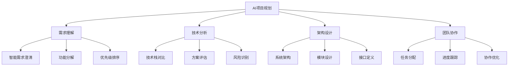
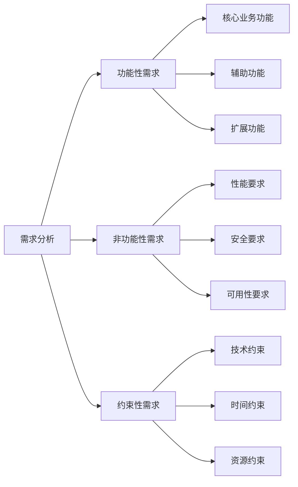
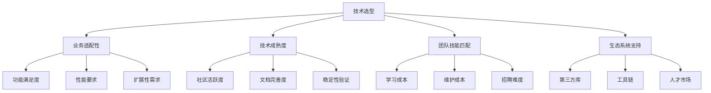
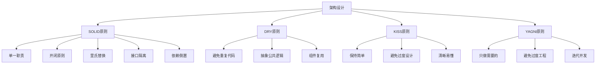
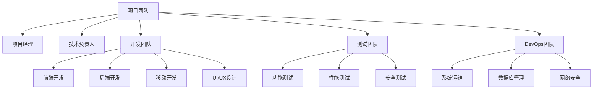
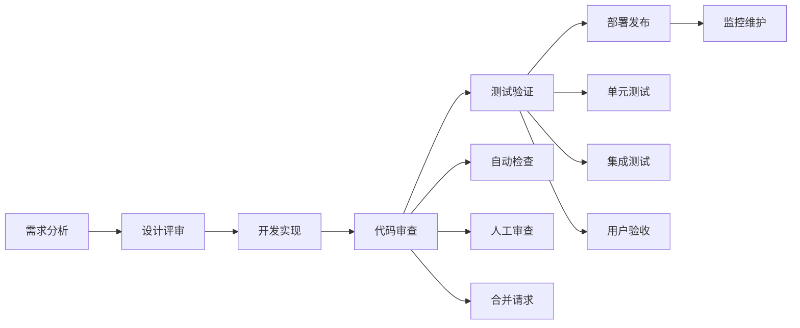
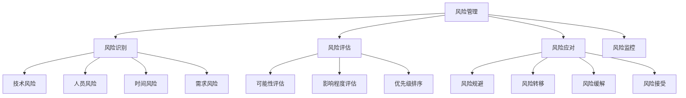
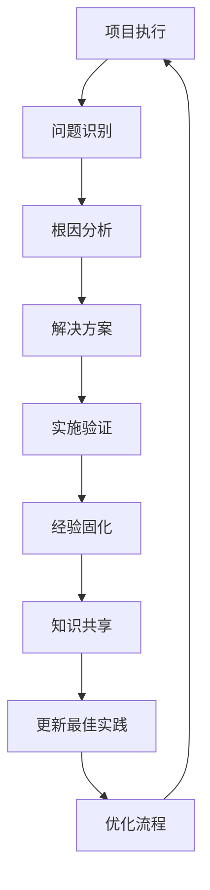

# Project Planning Methodology - AI项目规划方法论

> 基于Claude Code的AI项目规划最佳实践，让AI辅助开发更加高效和可控

## 📋 目录

1. [AI项目规划概述](#1-ai项目规划概述)
2. [需求分析阶段](#2-需求分析阶段)
3. [技术选型策略](#3-技术选型策略)
4. [架构设计流程](#4-架构设计流程)
5. [团队协作模式](#5-团队协作模式)
6. [项目执行监控](#6-项目执行监控)
7. [最佳实践总结](#7-最佳实践总结)

## 1. AI项目规划概述

### 传统vs AI辅助规划

#### 传统开发痛点
- **需求理解偏差**：人工沟通容易出现理解误差
- **技术选型困难**：缺乏全面的技术对比分析
- **架构设计复杂**：需要考虑的因素众多
- **进度控制困难**：难以准确评估工作量

#### AI辅助优势
- **智能需求分析**：AI帮助澄清和细化需求
- **全面技术调研**：自动分析技术方案优劣
- **架构优化建议**：基于最佳实践的设计建议
- **动态进度跟踪**：实时监控项目健康状况

### Claude Code规划能力



## 2. 需求分析阶段

### 需求收集方法

#### AI辅助需求澄清
```bash
# Claude Code需求分析提示词模板
请帮我分析这个项目需求：

项目背景：[描述项目背景和目标]
核心功能：[列出主要功能点]
用户群体：[描述目标用户]
约束条件：[列出技术和业务约束]

请从以下角度进行分析：
1. 需求可行性评估
2. 功能优先级建议
3. 潜在风险识别
4. 技术实现建议
```

#### 需求分类整理


### 需求优先级矩阵

#### 优先级评估模型
```bash
# 使用MoSCoW方法分类需求
Must Have (必须有)：
- 核心业务功能
- 基础安全要求
- 法规合规需求

Should Have (应该有)：
- 重要业务功能
- 性能优化
- 用户体验改善

Could Have (可以有)：
- 增值功能
- 锦上添花特性

Won't Have (暂时不做)：
- 超出范围需求
- 低价值功能
```

#### 实际应用示例
```yaml
# 电商项目需求优先级示例
priorities:
  must_have:
    - 用户注册登录
    - 商品浏览搜索
    - 购物车下单
    - 支付集成

  should_have:
    - 用户评价系统
    - 订单跟踪
    - 优惠券系统
    - 库存管理

  could_have:
    - 社交分享
    - 商品推荐
    - 积分系统

  wont_have:
    - 直播功能
    - AR试穿
    - 区块链积分
```

## 3. 技术选型策略

### 技术决策框架

#### 选型评估维度


#### AI辅助技术对比
```bash
# Claude Code技术分析提示词
请帮我分析以下技术方案的优劣：

项目类型：[Web应用/移动应用/桌面应用/系统工具]
核心需求：[性能/安全/开发效率/维护性]
团队能力：[前端水平/后端水平/DevOps能力]

对比方案：
1. 方案A：[具体技术栈]
2. 方案B：[具体技术栈]
3. 方案C：[具体技术栈]

请从以下维度进行对比分析：
- 开发效率
- 运行性能
- 学习成本
- 社区支持
- 长期维护
```

### 常见技术栈推荐

#### Web应用技术栈
```yaml
# 小型项目技术栈
small_project:
  frontend: "React + TypeScript + TailwindCSS"
  backend: "Node.js + Express + SQLite"
  deployment: "Vercel + Railway"
  cms: "Strapi/Contentful"

# 中型项目技术栈
medium_project:
  frontend: "Next.js + TypeScript + Ant Design"
  backend: "Node.js/NestJS + PostgreSQL"
  deployment: "AWS/DigitalOcean"
  monitoring: "Sentry + LogRocket"

# 大型项目技术栈
large_project:
  frontend: "React/Vue + TypeScript + Micro Frontends"
  backend: "Microservices + Kubernetes"
  database: "PostgreSQL + Redis + MongoDB"
  deployment: "AWS/GCP + CI/CD"
```

#### 移动应用技术栈
```yaml
# 跨平台方案
cross_platform:
  framework: "React Native/Flutter"
  state_management: "Redux/Provider/BLoC"
  backend: "Firebase/Supabase"
  deployment: "App Store/Google Play"

# 原生开发
native:
  ios: "Swift + SwiftUI"
  android: "Kotlin + Jetpack Compose"
  backend: "RESTful API + WebSocket"
```

## 4. 架构设计流程

### 架构设计原则

#### 核心设计原则


#### AI辅助架构设计
```bash
# Claude Code架构设计提示词
请帮我设计项目架构：

项目类型：[Web应用/移动应用/微服务]
业务复杂度：[简单/中等/复杂]
用户规模：[小型/中型/大型]
性能要求：[一般/高性能/极高性能]

请提供：
1. 整体架构图
2. 核心模块划分
3. 数据流转设计
4. 技术栈推荐
5. 关键设计决策
```

### 模块化设计

#### 模块拆分策略
```yaml
# 典型Web应用模块划分
modules:
  user_module:
    responsibilities:
      - 用户注册登录
      - 个人信息管理
      - 权限控制
    interfaces:
      - UserService
      - AuthController
    dependencies: [Database, Cache]

  product_module:
    responsibilities:
      - 商品管理
      - 分类管理
      - 库存管理
    interfaces:
      - ProductService
      - CategoryController
    dependencies: [Database, Storage]

  order_module:
    responsibilities:
      - 订单处理
      - 支付集成
      - 物流跟踪
    interfaces:
      - OrderService
      - PaymentController
    dependencies: [User, Product, Payment]

  notification_module:
    responsibilities:
      - 邮件通知
      - 短信通知
      - 推送通知
    interfaces:
      - NotificationService
    dependencies: [MessageQueue]
```

#### API设计规范
```yaml
# RESTful API设计规范
api_design:
  naming_convention:
    - 使用名词而非动词
    - 使用复数形式
    - 使用小写字母和连字符

  url_structure:
    collection: "/api/v1/resources"
    specific: "/api/v1/resources/{id}"
    nested: "/api/v1/users/{userId}/orders"

  http_methods:
    GET: "/api/v1/users"           # 获取列表
    POST: "/api/v1/users"          # 创建资源
    GET: "/api/v1/users/{id}"      # 获取详情
    PUT: "/api/v1/users/{id}"      # 完整更新
    PATCH: "/api/v1/users/{id}"    # 部分更新
    DELETE: "/api/v1/users/{id}"   # 删除资源
```

## 5. 团队协作模式

### 团队结构设计

#### 角色职责定义


#### 团队规模建议
```yaml
# 不同规模项目团队配置
team_sizes:
  small_project:  # 1-3人
    roles:
      - 全栈开发 (1-2人)
      - 产品/项目经理 (0.5人)

  medium_project:  # 3-8人
    roles:
      - 项目经理 (1人)
      - 前端开发 (1-2人)
      - 后端开发 (1-2人)
      - 测试工程师 (1人)
      - UI/UX设计师 (0.5人)

  large_project:   # 8-20人
    roles:
      - 项目经理 (1-2人)
      - 技术负责人 (1人)
      - 前端团队 (2-4人)
      - 后端团队 (3-6人)
      - 测试团队 (2-3人)
      - DevOps工程师 (1-2人)
      - 设计团队 (1-2人)
```

### 协作流程设计

#### 开发流程


#### 会议协作机制
```yaml
# 项目会议体系
meetings:
  daily_standup:
    frequency: "每日"
    duration: "15分钟"
    participants: "全体开发"
    agenda:
      - 昨日完成工作
      - 今日计划工作
      - 遇到的阻碍

  sprint_planning:
    frequency: "每2周"
    duration: "2小时"
    participants: "全体团队"
    agenda:
      - 需求评审
      - 任务分解
      - 工作量评估

  retrospective:
    frequency: "每2周"
    duration: "1小时"
    participants: "全体团队"
    agenda:
      - 做得好的地方
      - 需要改进的地方
      - 具体改进措施
```

## 6. 项目执行监控

### 进度跟踪方法

#### 里程碑管理
```yaml
# 项目里程碑设置
milestones:
  phase_1:
    name: "需求设计阶段"
    duration: "2周"
    deliverables:
      - 需求规格说明书
      - 系统架构设计
      - 技术选型报告

  phase_2:
    name: "核心开发阶段"
    duration: "6周"
    deliverables:
      - 核心功能模块
      - API接口实现
      - 基础测试用例

  phase_3:
    name: "功能完善阶段"
    duration: "4周"
    deliverables:
      - 完整功能实现
      - 系统测试报告
      - 用户手册

  phase_4:
    name: "测试部署阶段"
    duration: "2周"
    deliverables:
      - 性能优化
      - 安全测试
      - 生产环境部署
```

#### 风险管理


### 质量保证体系

#### 代码质量控制
```yaml
# 代码质量标准
code_quality:
  standards:
    coverage: "单元测试覆盖率 > 80%"
    complexity: "圈复杂度 < 10"
    duplication: "代码重复率 < 5%"
    maintainability: "可维护性指数 > 70"

  tools:
    linters: ["ESLint", "Prettier", "SonarQube"]
    testing: ["Jest", "Cypress", "Postman"]
    ci_cd: ["GitHub Actions", "Jenkins"]

  process:
    - 代码提交前自测
    - CI/CD自动检查
    - 代码审查流程
    - 定期重构优化
```

#### 项目健康指标
```bash
# Claude Code项目健康检查
请帮我检查项目健康状况：

检查维度：
1. 代码质量：测试覆盖率、代码复杂度、重复率
2. 开发效率：需求完成率、缺陷修复率、交付周期
3. 团队协作：沟通效率、知识共享、冲突解决
4. 技术债务：架构问题、性能瓶颈、安全隐患

请提供：
- 当前状况评估
- 改进建议
- 优先级排序
```

## 7. 最佳实践总结

### 项目规划Checklist

#### 启动阶段Checklist
```markdown
- [ ] **需求分析**
  - [ ] 明确项目目标和范围
  - [ ] 识别关键干系人
  - [ ] 收集和梳理需求
  - [ ] 评估需求可行性

- [ ] **技术选型**
  - [ ] 调研技术方案
  - [ ] 评估技术风险
  - [ ] 确认团队能力
  - [ ] 制定技术规范

- [ ] **架构设计**
  - [ ] 设计系统架构
  - [ ] 定义模块接口
  - [ ] 选择设计模式
  - [ ] 评审设计方案
```

#### 执行阶段Checklist
```markdown
- [ ] **开发管理**
  - [ ] 制定开发计划
  - [ ] 分配开发任务
  - [ ] 建立开发环境
  - [ ] 设置代码规范

- [ ] **质量控制**
  - [ ] 制定测试策略
  - [ ] 编写测试用例
  - [ ] 建立代码审查流程
  - [ ] 设置质量门禁

- [ ] **团队协作**
  - [ ] 建立沟通机制
  - [ ] 配置协作工具
  - [ ] 制定会议制度
  - [ ] 建立知识库
```

### 常见陷阱避免

#### 需求管理陷阱
```yaml
# 需求管理常见问题及解决方案
traps:
  scope_creep:
    problem: "需求范围不断扩大"
    solution: "建立需求变更控制流程"

  ambiguous_requirements:
    problem: "需求描述不清晰"
    solution: "使用用户故事和验收标准"

  gold_plating:
    problem: "过度设计不必要的功能"
    solution: "严格遵循优先级排序"
```

#### 技术决策陷阱
```yaml
# 技术选型常见问题
technical_traps:
  analysis_paralysis:
    problem: "过度分析导致决策延迟"
    solution: "设置决策时间限制"

  technology_chasing:
    problem: "追求最新技术而忽视实用性"
    solution: "优先考虑团队能力和项目需求"

  vendor_lock_in:
    problem: "过度依赖特定厂商"
    solution: "选择标准和开源技术"
```

### 持续改进机制

#### 经验总结流程


#### 知识管理体系
```yaml
# 项目知识管理
knowledge_management:
  documentation:
    - 项目架构文档
    - API接口文档
    - 部署运维文档
    - 故障处理手册

  sharing:
    - 技术分享会
    - 代码审查会议
    - 项目复盘会
    - 最佳实践总结

  tools:
    - Confluence知识库
    - Git文档管理
    - 技术博客
    - 内部培训
```

## 总结

Project Planning Methodology 通过系统化的方法论，让AI项目开发更加可控和高效：

### 🎯 核心价值

1. **系统性思维**：从需求到部署的全流程规划
2. **风险控制**：提前识别和应对潜在风险
3. **团队协同**：建立高效的协作机制
4. **持续改进**：通过反馈不断优化流程

### 🚀 实施建议

1. **因地制宜**：根据项目特点调整方法论
2. **渐进实施**：从简单开始，逐步完善
3. **团队培训**：确保团队理解并接受方法论
4. **工具支持**：选择合适的项目管理工具

通过这套方法论，AI项目开发将变得更加规范、高效和可预测。