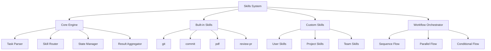
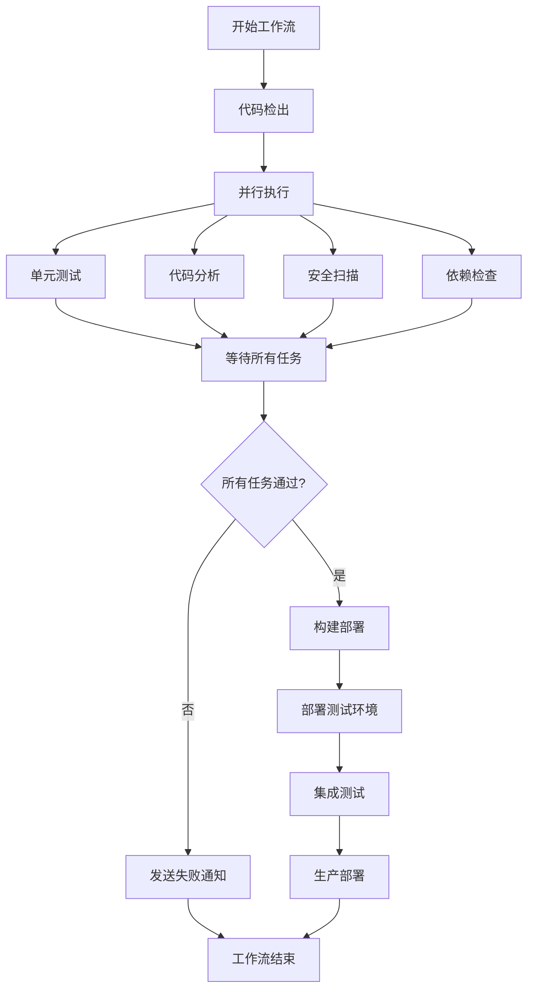

# Claude Skills Workflow System - Claude Skills工作流系统

> 基于实际使用经验，介绍Claude Code Skills系统的开发和使用方法，构建高效的AI工作流

## 📋 目录

1. [Skills系统概述](#1-skills系统概述)
2. [内置Skills使用](#2-内置skills使用)
3. [自定义Skills开发](#3-自定义skills开发)
4. [工作流编排](#4-工作流编排)
5. [技能集成实战](#5-技能集成实战)
6. [高级功能应用](#6-高级功能应用)
7. [最佳实践总结](#7-最佳实践总结)

## 1. Skills系统概述

### Skills架构

Claude Code Skills系统是一个强大的工作流编排平台，支持自定义技能开发和复杂任务自动化：



### 核心特性

#### ✨ 主要能力
- **模块化设计**：技能可独立开发和测试
- **灵活编排**：支持串行、并行、条件执行
- **参数传递**：技能间数据流转和状态共享
- **错误处理**：完善的异常处理和重试机制
- **可视化管理**：图形化的工作流编辑器

#### 🎯 应用场景
- **开发自动化**：CI/CD流程、代码审查
- **文档处理**：PDF解析、格式转换
- **项目管理**：任务分配、进度跟踪
- **数据处理**：ETL流程、报告生成

## 2. 内置Skills使用

### Git相关Skills

#### git技能
```bash
# 基础Git操作
/skill git status
/skill git add .
/skill git commit -m "feat: add new feature"

# 分支管理
/skill git checkout -b feature/new-feature
/skill git merge feature/new-feature
/skill git push origin main
```

#### commit技能
```bash
# 智能提交生成
/skill commit

# 带参数的提交
/skill commit --message "fix: resolve authentication issue"
/skill commit --add-only "*.js" --type "fix"
```

#### review-pr技能
```bash
# PR代码审查
/skill review-pr 123
/skill review-pr --pr-number 123 --detailed
/skill review-pr --auto-comment --suggest-improvements
```

### 文档处理Skills

#### pdf技能
```bash
# PDF文档处理
/skill pdf analyze document.pdf
/skill pdf extract-text document.pdf --output text.txt
/skill pdf convert document.pdf --format markdown
```

#### 文件转换技能
```bash
# 格式转换
/skill convert file.docx --to pdf
/skill convert data.json --to csv
/skill convert image.png --to webp --quality 80
```

### 项目管理Skills

#### 任务管理
```bash
# 任务分配和跟踪
/skill assign-task --to "developer1" --task "Implement user auth"
/skill track-progress --project "website" --milestone "v1.0"
/skill generate-report --type "weekly" --format html
```

#### 代码质量检查
```bash
# 代码质量分析
/skill analyze-code --path "src/" --metrics "complexity,coverage"
/skill find-bugs --threshold "high"
/skill suggest-refactoring --file "legacy.js"
```

## 3. 自定义Skills开发

### Skill开发基础

#### Skill结构
```yaml
# skill-definition.yaml
name: "custom-analyzer"
version: "1.0.0"
description: "自定义数据分析技能"
author: "Your Name"
tags: ["analysis", "data"]

# 参数定义
parameters:
  input_file:
    type: string
    required: true
    description: "输入文件路径"

  output_format:
    type: string
    default: "json"
    options: ["json", "csv", "markdown"]
    description: "输出格式"

# 执行步骤
steps:
  - name: "load_data"
    action: "read_file"
    params:
      file: "{{input_file}}"

  - name: "process_data"
    action: "run_script"
    script: |
      # 数据处理逻辑
      data = load_data(input_file)
      processed = analyze_data(data)
      return processed

  - name: "save_result"
    action: "write_file"
    params:
      file: "output.{{output_format}}"
      content: "{{steps.process_data.result}}"
```

#### JavaScript Skill开发
```javascript
// custom-skill.js
class CustomAnalyzer {
  constructor(config = {}) {
    this.config = {
      timeout: config.timeout || 30000,
      retries: config.retries || 3,
      ...config
    };
  }

  async execute(params) {
    try {
      // 1. 参数验证
      this.validateParams(params);

      // 2. 数据加载
      const data = await this.loadData(params.input_file);

      // 3. 数据处理
      const result = await this.analyzeData(data, params);

      // 4. 结果输出
      await this.saveResult(result, params.output_format);

      return {
        success: true,
        message: "分析完成",
        output: result
      };
    } catch (error) {
      return {
        success: false,
        error: error.message,
        suggestion: this.getErrorMessage(error)
      };
    }
  }

  validateParams(params) {
    if (!params.input_file) {
      throw new Error("缺少必需参数: input_file");
    }

    if (!this.fileExists(params.input_file)) {
      throw new Error(`文件不存在: ${params.input_file}`);
    }
  }

  async loadData(filePath) {
    const fs = require('fs').promises;
    const content = await fs.readFile(filePath, 'utf8');

    // 根据文件类型解析
    if (filePath.endsWith('.json')) {
      return JSON.parse(content);
    } else if (filePath.endsWith('.csv')) {
      return this.parseCSV(content);
    } else {
      return content;
    }
  }

  async analyzeData(data, params) {
    // 自定义分析逻辑
    const analysis = {
      summary: this.generateSummary(data),
      insights: this.extractInsights(data),
      recommendations: this.generateRecommendations(data)
    };

    return analysis;
  }

  async saveResult(result, format) {
    const fs = require('fs').promises;
    let content;
    let filename;

    switch (format) {
      case 'json':
        content = JSON.stringify(result, null, 2);
        filename = 'analysis-result.json';
        break;
      case 'csv':
        content = this.convertToCSV(result);
        filename = 'analysis-result.csv';
        break;
      case 'markdown':
        content = this.convertToMarkdown(result);
        filename = 'analysis-result.md';
        break;
    }

    await fs.writeFile(filename, content);
    return filename;
  }
}

// 注册技能
module.exports = {
  name: 'custom-analyzer',
  class: CustomAnalyzer,
  description: '自定义数据分析技能'
};
```

### Python Skill开发

#### Python技能模板
```python
# custom_skill.py
import json
import pandas as pd
from pathlib import Path
from typing import Dict, Any, Optional

class DataAnalyzer:
    def __init__(self, config: Optional[Dict] = None):
        self.config = config or {}
        self.required_params = ['input_file']

    def validate_params(self, params: Dict[str, Any]) -> None:
        """验证输入参数"""
        for param in self.required_params:
            if param not in params:
                raise ValueError(f"缺少必需参数: {param}")

        if not Path(params['input_file']).exists():
            raise FileNotFoundError(f"文件不存在: {params['input_file']}")

    def load_data(self, file_path: str) -> pd.DataFrame:
        """加载数据"""
        if file_path.endswith('.csv'):
            return pd.read_csv(file_path)
        elif file_path.endswith('.json'):
            return pd.read_json(file_path)
        elif file_path.endswith('.xlsx'):
            return pd.read_excel(file_path)
        else:
            raise ValueError(f"不支持的文件格式: {file_path}")

    def analyze_data(self, data: pd.DataFrame, params: Dict[str, Any]) -> Dict[str, Any]:
        """分析数据"""
        analysis = {
            'basic_stats': data.describe().to_dict(),
            'missing_values': data.isnull().sum().to_dict(),
            'data_types': data.dtypes.to_dict(),
            'shape': data.shape
        }

        # 自定义分析逻辑
        if 'custom_analysis' in params:
            analysis['custom'] = self.custom_analysis(data, params['custom_analysis'])

        return analysis

    def custom_analysis(self, data: pd.DataFrame, config: Dict[str, Any]) -> Dict[str, Any]:
        """自定义分析逻辑"""
        results = {}

        for analysis_type, params in config.items():
            if analysis_type == 'correlation':
                results['correlation_matrix'] = data.corr().to_dict()
            elif analysis_type == 'groupby':
                group_col = params.get('column')
                if group_col in data.columns:
                    results['groupby_stats'] = data.groupby(group_col).describe().to_dict()

        return results

    def save_result(self, result: Dict[str, Any], output_format: str) -> str:
        """保存结果"""
        timestamp = pd.Timestamp.now().strftime('%Y%m%d_%H%M%S')

        if output_format == 'json':
            filename = f"analysis_{timestamp}.json"
            with open(filename, 'w', encoding='utf-8') as f:
                json.dump(result, f, ensure_ascii=False, indent=2)

        elif output_format == 'csv':
            filename = f"analysis_{timestamp}.csv"
            # 转换DataFrame并保存
            df = pd.DataFrame(result)
            df.to_csv(filename, index=False)

        elif output_format == 'markdown':
            filename = f"analysis_{timestamp}.md"
            with open(filename, 'w', encoding='utf-8') as f:
                f.write("# 数据分析报告\n\n")
                f.write(f"生成时间: {timestamp}\n\n")
                for key, value in result.items():
                    f.write(f"## {key}\n\n")
                    f.write(f"```json\n{json.dumps(value, ensure_ascii=False, indent=2)}\n```\n\n")

        return filename

# 技能入口点
def execute(params: Dict[str, Any]) -> Dict[str, Any]:
    """技能执行入口"""
    try:
        analyzer = DataAnalyzer()
        analyzer.validate_params(params)

        # 加载数据
        data = analyzer.load_data(params['input_file'])

        # 分析数据
        result = analyzer.analyze_data(data, params)

        # 保存结果
        output_format = params.get('output_format', 'json')
        filename = analyzer.save_result(result, output_format)

        return {
            'success': True,
            'message': '分析完成',
            'output_file': filename,
            'result': result
        }

    except Exception as e:
        return {
            'success': False,
            'error': str(e),
            'suggestion': '请检查输入参数和文件格式'
        }

# 技能元数据
skill_metadata = {
    'name': 'data-analyzer',
    'version': '1.0.0',
    'description': '数据分析技能，支持多种文件格式和分析类型',
    'author': 'Your Name',
    'parameters': {
        'input_file': {'type': 'string', 'required': True},
        'output_format': {'type': 'string', 'default': 'json', 'options': ['json', 'csv', 'markdown']},
        'custom_analysis': {'type': 'object', 'required': False}
    }
}
```

## 4. 工作流编排

### 工作流定义

#### YAML工作流定义
```yaml
# workflow.yaml
name: "code-review-automation"
version: "1.0.0"
description: "自动化代码审查工作流"

# 全局变量
variables:
  project_path: "./src"
  review_threshold: 80
  notification_channel: "#code-review"

# 工作流步骤
steps:
  - name: "load_changes"
    skill: "git"
    action: "diff"
    params:
      path: "{{project_path}}"
      target_branch: "main"
    output:
      changed_files: "files"

  - name: "analyze_code"
    skill: "custom-analyzer"
    params:
      input_files: "{{steps.load_changes.output.files}}"
      analysis_type: "quality,security,performance"
    parallel: true
    output:
      analysis_results: "results"

  - name: "check_tests"
    skill: "test-runner"
    params:
      files: "{{steps.load_changes.output.files}}"
      coverage_threshold: 80
    condition: "{{#contains steps.load_changes.output.files '*.test.js'}}"
    output:
      test_results: "tests"

  - name: "generate_report"
    skill: "report-generator"
    params:
      analysis: "{{steps.analyze_code.output.results}}"
      tests: "{{steps.check_tests.output.tests}}"
      template: "code-review-template"
    output:
      report_file: "report"

  - name: "notify_team"
    skill: "notification"
    params:
      channel: "{{notification_channel}}"
      message: "代码审查完成，报告已生成: {{steps.generate_report.output.report_file}}"
      attachments: ["{{steps.generate_report.output.report_file}}"]
    on_error: "continue"

# 错误处理
error_handling:
  retry_count: 3
  retry_delay: 30
  notification_on_failure: true
```

#### 条件工作流
```yaml
# conditional-workflow.yaml
name: "deployment-pipeline"
description: "部署流水线工作流"

steps:
  - name: "run_tests"
    skill: "test-runner"
    params:
      all_tests: true
      coverage: true
    output:
      success: "tests_passed"
      coverage: "test_coverage"

  - name: "security_scan"
    skill: "security-scanner"
    params:
      path: "./"
      severity_threshold: "medium"
    condition: "{{steps.run_tests.output.tests_passed}}"
    output:
      vulnerabilities: "security_issues"

  - name: "deploy_staging"
    skill: "deploy"
    params:
      environment: "staging"
      rollback_on_failure: true
    condition:
      and:
        - "{{steps.run_tests.output.tests_passed}}"
        - "{{lt steps.security_scan.output.vulnerabilities.high 0}}"
    output:
      deployment_url: "staging_url"

  - name: "integration_tests"
    skill: "integration-test"
    params:
      url: "{{steps.deploy_staging.output.staging_url}}"
      test_suite: "integration"
    condition: "{{steps.deploy_staging.output.staging_url}}"
    output:
      success: "integration_passed"

  - name: "deploy_production"
    skill: "deploy"
    params:
      environment: "production"
      approval_required: true
    condition: "{{steps.integration_tests.output.integration_passed}}"
    output:
      production_url: "prod_url"

  - name: "notify_success"
    skill: "notification"
    params:
      type: "success"
      message: "部署成功完成: {{steps.deploy_production.output.prod_url}}"
    condition: "{{steps.deploy_production.output.prod_url}}"
```

### 并行工作流

#### 并行任务执行


#### 并行工作流定义
```yaml
# parallel-workflow.yaml
name: "comprehensive-analysis"
description: "全面项目分析工作流"

steps:
  - name: "setup"
    skill: "setup"
    params:
      project_path: "./"
    output:
      project_info: "info"

  - name: "parallel_analysis"
    parallel: true
    branches:
      - name: "code_quality"
        steps:
          - name: "lint_code"
            skill: "linter"
            params:
              path: "{{steps.setup.output.project_info.source_path}}"

          - name: "calculate_complexity"
            skill: "complexity-analyzer"
            params:
              files: "{{steps.setup.output.project_info.files}}"

      - name: "testing"
        steps:
          - name: "run_unit_tests"
            skill: "test-runner"
            params:
              type: "unit"
              coverage: true

          - name: "run_integration_tests"
            skill: "test-runner"
            params:
              type: "integration"

      - name: "security"
        steps:
          - name: "vulnerability_scan"
            skill: "security-scanner"
            params:
              severity: "high"

          - name: "dependency_check"
            skill: "dependency-checker"
            params:
              check_vulnerabilities: true

      - name: "performance"
        steps:
          - name: "benchmark"
            skill: "performance-test"
            params:
              scenarios: ["load", "stress"]

          - name: "profile_memory"
            skill: "memory-profiler"
            params:
              duration: 300

  - name: "aggregate_results"
    skill: "result-aggregator"
    params:
      inputs:
        - "{{steps.parallel_analysis.branches.code_quality}}"
        - "{{steps.parallel_analysis.branches.testing}}"
        - "{{steps.parallel_analysis.branches.security}}"
        - "{{steps.parallel_analysis.branches.performance}}"
    output:
      aggregated_report: "report"

  - name: "generate_dashboard"
    skill: "dashboard-generator"
    params:
      data: "{{steps.aggregate_results.output.aggregated_report}}"
      template: "project-dashboard"
    output:
      dashboard_url: "dashboard"
```

## 5. 技能集成实战

### 实战案例1：自动化代码发布

#### 完整发布工作流
```yaml
# release-workflow.yaml
name: "automated-release"
description: "自动化代码发布流程"

variables:
  version: ""
  release_notes: "CHANGELOG.md"
  deploy_envs: ["staging", "production"]

steps:
  - name: "pre_release_checks"
    skill: "pre-release-checker"
    params:
      checks: ["tests", "linting", "security", "documentation"]
    output:
      ready: "can_release"

  - name: "bump_version"
    skill: "version-bumper"
    params:
      type: "patch"  # auto-detect based on commits
      update_files: ["package.json", "version.txt"]
    condition: "{{steps.pre_release_checks.output.ready}}"
    output:
      new_version: "version"

  - name: "generate_changelog"
    skill: "changelog-generator"
    params:
      since: "{{variables.version}}"
      template: "standard"
      output_file: "{{variables.release_notes}}"
    output:
      changelog: "release_notes"

  - name: "create_git_tag"
    skill: "git"
    action: "tag"
    params:
      tag: "v{{steps.bump_version.output.new_version}}"
      message: "Release v{{steps.bump_version.output.new_version}}"

  - name: "build_artifacts"
    skill: "build"
    params:
      target: "production"
      optimize: true
      minify: true
    output:
      artifacts: "build_files"

  - name: "deploy_staging"
    skill: "deploy"
    params:
      environment: "staging"
      artifacts: "{{steps.build_artifacts.output.build_files}}"
      rollback: true
    output:
      staging_url: "staging_url"

  - name: "smoke_tests"
    skill: "smoke-test"
    params:
      url: "{{steps.deploy_staging.output.staging_url}}"
      critical_paths: ["/login", "/dashboard", "/api/health"]
    output:
      smoke_passed: "tests_ok"

  - name: "deploy_production"
    skill: "deploy"
    params:
      environment: "production"
      artifacts: "{{steps.build_artifacts.output.build_files}}"
      approval: true
    condition: "{{steps.smoke_tests.output.tests_ok}}"
    output:
      production_url: "prod_url"

  - name: "create_github_release"
    skill: "github"
    action: "create-release"
    params:
      tag: "v{{steps.bump_version.output.new_version}}"
      name: "Release v{{steps.bump_version.output.new_version}}"
      body: "{{steps.generate_changelog.output.release_notes}}"
      assets: "{{steps.build_artifacts.output.build_files}}"

  - name: "notify_teams"
    skill: "notification"
    params:
      channels: ["#releases", "#development"]
      message: |
        🚀 Release v{{steps.bump_version.output.new_version}} deployed successfully!

        Staging: {{steps.deploy_staging.output.staging_url}}
        Production: {{steps.deploy_production.output.prod_url}}

        Release notes: {{steps.generate_changelog.output.release_notes}}
```

### 实战案例2：智能数据分析

#### 数据分析工作流
```yaml
# data-analysis-workflow.yaml
name: "intelligent-data-analysis"
description: "智能数据分析与报告生成"

steps:
  - name: "data_ingestion"
    skill: "data-loader"
    params:
      sources:
        - type: "database"
          connection: "postgresql://..."
          query: "SELECT * FROM sales WHERE date >= '2024-01-01'"
        - type: "api"
          url: "https://api.external-data.com/metrics"
          auth: "bearer_token"
        - type: "file"
          path: "./data/supplementary_data.csv"
    output:
      raw_data: "dataset"

  - name: "data_cleaning"
    skill: "data-cleaner"
    params:
      data: "{{steps.data_ingestion.output.dataset}}"
      operations:
        - remove_duplicates
        - handle_missing_values
        - normalize_text
        - validate_data_types
    output:
      clean_data: "cleaned_dataset"

  - name: "exploratory_analysis"
    skill: "statistical-analyzer"
    params:
      data: "{{steps.data_cleaning.output.cleaned_dataset}}"
      analysis_types:
        - descriptive_stats
        - correlation_analysis
        - trend_analysis
        - outlier_detection
    output:
      insights: "statistical_insights"

  - name: "ml_analysis"
    skill: "machine-learning"
    params:
      data: "{{steps.data_cleaning.output.cleaned_dataset}}"
      models:
        - type: "clustering"
          algorithm: "kmeans"
          features: ["sales", "customers", "region"]
        - type: "forecasting"
          algorithm: "prophet"
          target: "revenue"
          period: "30d"
    output:
      predictions: "ml_results"

  - name: "visualization"
    skill: "chart-generator"
    params:
      data: "{{steps.data_cleaning.output.cleaned_dataset}}"
      insights: "{{steps.exploratory_analysis.output.statistical_insights}}"
      predictions: "{{steps.ml_analysis.output.ml_results}}"
      charts:
        - type: "line"
          title: "Sales Trend"
          x: "date"
          y: "revenue"
        - type: "heatmap"
          title: "Regional Performance"
          data: "correlation_matrix"
        - type: "scatter"
          title: "Customer Segments"
          x: "frequency"
          y: "value"
    output:
      charts: "visualizations"

  - name: "report_generation"
    skill: "report-generator"
    params:
      template: "executive-dashboard"
      data:
        summary: "{{steps.exploratory_analysis.output.statistical_insights}}"
        predictions: "{{steps.ml_analysis.output.ml_results}}"
        charts: "{{steps.visualization.output.visualizations}}"
      format: ["html", "pdf", "powerpoint"]
    output:
      reports: "analysis_reports"

  - name: "distribution"
    skill: "distributor"
    params:
      reports: "{{steps.report_generation.output.analysis_reports}}"
      channels:
        - type: "email"
          recipients: ["executives@company.com", "data-team@company.com"]
          subject: "Monthly Sales Analysis Report"
        - type: "slack"
          channels: ["#analytics", "#leadership"]
          message: "Monthly sales analysis report is ready!"
        - type: "dashboard"
          url: "https://dashboard.company.com/sales-analysis"
```

## 6. 高级功能应用

### 技能版本管理

#### 版本控制策略
```yaml
# skill-versioning.yaml
skill: "data-analyzer"
version: "2.1.0"

# 版本历史
versions:
  "2.1.0":
    changes:
      - "新增机器学习模型支持"
      - "优化大数据集处理性能"
      - "修复内存泄漏问题"
    compatibility: "backward"
    migration_required: false

  "2.0.0":
    changes:
      - "重构核心分析引擎"
      - "新增并行处理支持"
      - "API接口重大更新"
    compatibility: "breaking"
    migration_required: true
    migration_script: "migrate_v2.py"

  "1.5.0":
    changes:
      - "增加可视化支持"
      - "优化错误处理"
    compatibility: "backward"
    migration_required: false

# 版本兼容性矩阵
compatibility_matrix:
  "2.1.0":
    supported_params:
      - "input_format"
      - "analysis_type"
      - "output_format"
      - "ml_model"
    deprecated_params:
      - "old_analysis_mode"
    removed_params:
      - "legacy_format"

# 自动迁移配置
migration:
  auto_migrate: true
  backup_before_migration: true
  test_migration: true
  rollback_on_failure: true
```

### 技能市场与共享

#### 技能发布配置
```yaml
# skill-marketplace.yaml
skill_package:
  name: "advanced-data-processor"
  version: "1.2.0"
  author: "DataScience Team"
  license: "MIT"
  repository: "https://github.com/company/skills"

# 市场发布信息
marketplace:
  category: "Data Processing"
  tags: ["data", "analysis", "ml", "automation"]
  description: "高级数据处理和分析技能，支持机器学习集成"

  screenshots:
    - "screenshots/overview.png"
    - "screenshots/configuration.png"
    - "screenshots/results.png"

  documentation:
    readme: "README.md"
    examples: "examples/"
    api_docs: "docs/api.md"

# 依赖管理
dependencies:
  skills:
    - name: "base-analyzer"
      version: ">=1.0.0"
    - name: "ml-integration"
      version: ">=2.0.0"

  python_packages:
    - "pandas>=1.3.0"
    - "scikit-learn>=1.0.0"
    - "matplotlib>=3.5.0"

  system_requirements:
    python: ">=3.8"
    memory: ">=2GB"
    disk_space: ">=1GB"

# 测试配置
testing:
  unit_tests: "tests/unit/"
  integration_tests: "tests/integration/"
  performance_tests: "tests/performance/"

  test_data:
    - "data/sample.csv"
    - "data/test_data.json"

  coverage_threshold: 85
  performance_benchmarks:
    processing_time: "<30s for 1MB data"
    memory_usage: "<500MB"
```

### 监控和日志

#### 技能监控配置
```yaml
# skill-monitoring.yaml
monitoring:
  metrics:
    execution_time:
      enabled: true
      alert_threshold: "5m"
      history_retention: "30d"

    success_rate:
      enabled: true
      alert_threshold: "<95%"
      window: "24h"

    error_rate:
      enabled: true
      alert_threshold: ">5%"
      window: "1h"

    resource_usage:
      cpu_usage:
        alert_threshold: ">80%"
      memory_usage:
        alert_threshold: ">1GB"
      disk_io:
        alert_threshold: ">100MB/s"

  logging:
    level: "INFO"
    format: "json"
    outputs:
      - type: "file"
        path: "/var/log/skills/{{skill_name}}.log"
        rotation: "daily"
        retention: "30d"
      - type: "elasticsearch"
        endpoint: "https://logs.company.com"
        index: "skills-logs"
      - type: "slack"
        webhook: "${SLACK_WEBHOOK_URL}"
        channel: "#skill-alerts"
        level: "ERROR"

  health_checks:
    endpoint: "/health"
    interval: "30s"
    timeout: "10s"
    retries: 3

    checks:
      - name: "database_connection"
        type: "external"
        config:
          url: "${DATABASE_URL}"
          timeout: "5s"

      - name: "api_availability"
        type: "http"
        config:
          url: "https://api.company.com/health"
          expected_status: 200
```

## 7. 最佳实践总结

### 开发最佳实践

#### 技能设计原则
```yaml
# design-principles.yaml
principles:
  single_responsibility:
    description: "每个技能只负责一个明确的功能"
    example: "代码审查技能只做代码分析，不做部署"

  idempotent:
    description: "多次执行产生相同结果"
    implementation: "使用幂等性设计和幂等性检查"

  retryable:
    description: "支持失败重试"
    implementation: "实现幂等性和状态恢复机制"

  observable:
    description: "提供充分的日志和监控"
    implementation: "结构化日志、性能指标、健康检查"

  testable:
    description: "易于单元测试和集成测试"
    implementation: "依赖注入、模拟接口、测试数据"
```

#### 性能优化技巧
```yaml
# performance-optimization.yaml
optimization_strategies:
  caching:
    description: "缓存重复计算结果"
    implementation:
      - "内存缓存常用数据"
      - "Redis缓存分布式结果"
      - "文件缓存大文件处理结果"

  parallel_processing:
    description: "并行处理独立任务"
    implementation:
      - "多线程处理CPU密集型任务"
      - "异步处理I/O密集型任务"
      - "分布式处理大规模数据"

  batch_processing:
    description: "批量处理减少开销"
    implementation:
      - "数据库批量操作"
      - "API批量请求"
      - "文件批量处理"

  lazy_loading:
    description: "按需加载资源"
    implementation:
      - "延迟初始化重对象"
      - "按需加载配置文件"
      - "流式处理大文件"
```

### 团队协作建议

#### 技能共享规范
```markdown
# 技能共享规范

## 技能命名规范
- 使用清晰、描述性的名称
- 采用动词-名词结构
- 避免缩写和专业术语

示例：
- ✅ `analyze-code-quality`
- ✅ `generate-test-report`
- ❌ `acq` (acquire的缩写)
- ❌ `data-proc-ml-v2`

## 文档要求
每个技能必须包含：
1. **README.md** - 技能介绍和使用说明
2. **CHANGELOG.md** - 版本变更记录
3. **examples/** - 使用示例
4. **tests/** - 完整的测试用例

## 代码规范
- 遵循项目编码标准
- 添加充分的注释和文档字符串
- 实现错误处理和日志记录
- 提供清晰的错误消息

## 版本管理
- 使用语义化版本 (SemVer)
- 主版本号变更时提供迁移指南
- 保持向后兼容性
```

### 故障排除指南

#### 常见问题解决
```yaml
# troubleshooting-guide.yaml
common_issues:
  skill_not_found:
    symptoms:
      - "Error: Skill 'xxx' not found"
      - "技能执行失败"
    solutions:
      - 检查技能名称拼写
      - 确认技能已正确安装
      - 重新加载技能库

  parameter_validation_failed:
    symptoms:
      - "Parameter validation error"
      - "缺少必需参数"
    solutions:
      - 检查参数名称和类型
      - 查看技能文档确认参数要求
      - 使用默认参数测试

  execution_timeout:
    symptoms:
      - "Execution timeout"
      - "技能执行超时"
    solutions:
      - 增加超时时间配置
      - 优化技能性能
      - 检查网络和资源状况

  memory_exhausted:
    symptoms:
      - "Out of memory error"
      - "系统内存不足"
    solutions:
      - 优化内存使用
      - 增加系统内存
      - 使用流式处理大数据

debugging_steps:
  1. "检查技能日志"
  2. "验证输入参数"
  3. "测试独立功能"
  4. "检查资源使用"
  5. "查看系统状态"
```

## 总结

Claude Skills Workflow System 通过强大的技能系统和工作流编排能力，让复杂的自动化任务变得简单：

### 🎯 核心价值

1. **模块化设计**：技能可独立开发、测试和维护
2. **灵活编排**：支持复杂的串行、并行、条件工作流
3. **易于扩展**：开放的技能开发框架和丰富的API
4. **企业级特性**：完善的监控、日志、版本管理

### 🚀 实施建议

1. **从简单开始**：先使用内置技能，再开发自定义技能
2. **逐步完善**：持续优化工作流和技能性能
3. **团队协作**：建立技能共享和协作机制
4. **持续监控**：建立完善的监控和告警体系

通过合理使用Skills系统，可以大幅提升开发效率，实现复杂的自动化工作流。