# AI Product Development - AI产品开发最佳实践

> 基于Claude Code实战经验，分享AI产品开发的完整方法论和实用技巧

## 📋 目录

1. [AI产品开发概述](#1-ai产品开发概述)
2. [产品策略规划](#2-产品策略规划)
3. [技术架构设计](#3-技术架构设计)
4. [用户体验优化](#4-用户体验优化)
5. [数据处理流程](#5-数据处理流程)
6. [模型部署与监控](#6-模型部署与监控)
7. [商业化与推广](#7-商业化与推广)

## 1. AI产品开发概述

### AI产品vs传统产品

#### 核心差异
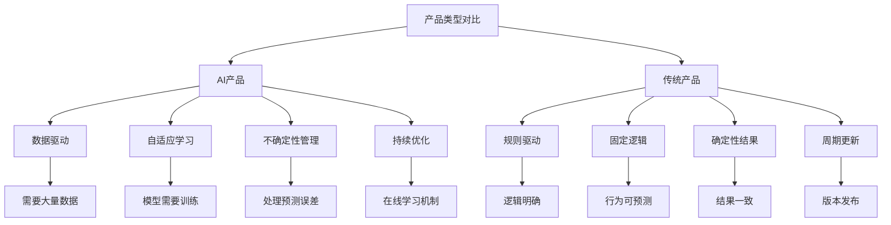

#### 开发挑战
```yaml
# AI产品开发独特挑战
challenges:
  data_challenges:
    - "数据质量和数量要求高"
    - "数据隐私和合规性"
    - "标注成本和时间"
    - "数据漂移问题"

  model_challenges:
    - "模型性能与准确性"
    - "泛化能力不足"
    - "计算资源消耗"
    - "实时性要求"

  product_challenges:
    - "用户期望管理"
    - "AI决策可解释性"
    - "错误处理机制"
    - "用户信任建立"
```

### 开发流程框架

#### AI产品开发生命周期
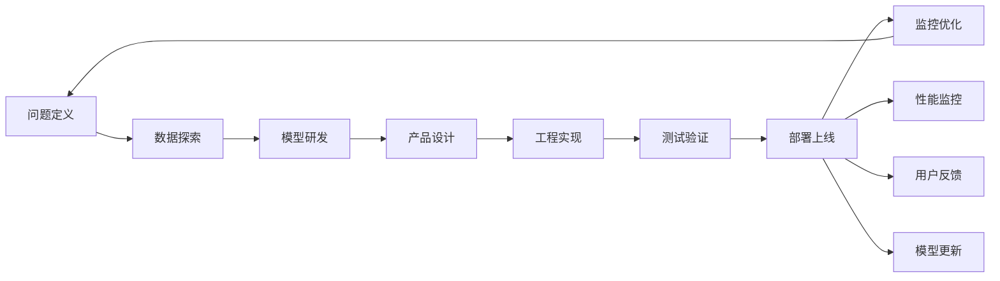

## 2. 产品策略规划

### 市场机会分析

#### AI产品机会识别
```bash
# Claude Code市场分析提示词
请帮我分析AI产品的市场机会：

分析维度：
1. 技术成熟度评估
2. 市场需求规模
3. 竞争格局分析
4. 商业模式可行性
5. 实施难度评估

请基于以下行业信息：
[具体行业背景和现状]

输出要求：
- 机会评分 (1-10分)
- 风险评估
- 进入策略建议
- 关键成功因素
```

#### 机会评估矩阵
```yaml
# AI产品机会评估
opportunity_matrix:
  high_potential:
    criteria:
      market_size: ">10亿"
      growth_rate: ">30%"
      technical_feasibility: "高"
      competitive_advantage: "明显"
    examples:
      - "智能客服系统"
      - "个性化推荐引擎"
      - "自动化代码审查"

  medium_potential:
    criteria:
      market_size: "1-10亿"
      growth_rate: "10-30%"
      technical_feasibility: "中等"
      competitive_advantage: "一般"
    examples:
      - "智能文档处理"
      - "图像识别工具"
      - "自然语言处理API"

  low_potential:
    criteria:
      market_size: "<1亿"
      growth_rate: "<10%"
      technical_feasibility: "低"
      competitive_advantage: "无"
    examples:
      - "过度复杂的技术方案"
      - "需求不明确的产品"
```

### 用户需求洞察

#### 用户画像构建
```yaml
# AI产品用户画像
user_personas:
  technical_user:
    demographics:
      age: "25-40"
      role: "开发者/工程师"
      experience: "3-10年"
    needs:
      - "API接口易用性"
      - "文档完整性"
      - "性能指标透明"
      - "调试工具支持"
    pain_points:
      - "集成复杂度高"
      - "模型黑盒问题"
      - "性能不可预测"

  business_user:
    demographics:
      age: "30-50"
      role: "产品经理/业务决策者"
      experience: "5-15年"
    needs:
      - "业务价值明确"
      - "ROI可衡量"
      - "部署简单"
      - "维护成本低"
    pain_points:
      - "技术理解困难"
      - "效果难以评估"
      - "风险控制担忧"
```

#### 需求优先级排序
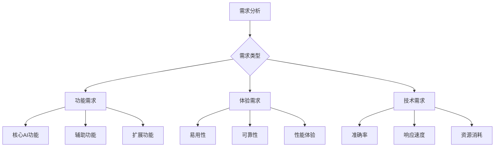

## 3. 技术架构设计

### AI系统架构

#### 分层架构设计
```yaml
# AI产品系统架构
system_architecture:
  presentation_layer:
    components:
      - "Web界面/移动端"
      - "API网关"
      - "负载均衡"
    responsibilities:
      - "用户交互"
      - "请求路由"
      - "安全认证"

  application_layer:
    components:
      - "业务逻辑服务"
      - "工作流引擎"
      - "缓存服务"
    responsibilities:
      - "业务流程控制"
      - "数据预处理"
      - "结果后处理"

  ai_layer:
    components:
      - "模型服务"
      - "推理引擎"
      - "模型管理"
    responsibilities:
      - "模型推理"
      - "模型版本控制"
      - "A/B测试"

  data_layer:
    components:
      - "特征存储"
      - "数据湖"
      - "模型存储"
    responsibilities:
      - "数据管理"
      - "特征工程"
      - "模型训练支持"
```

#### 微服务架构示例
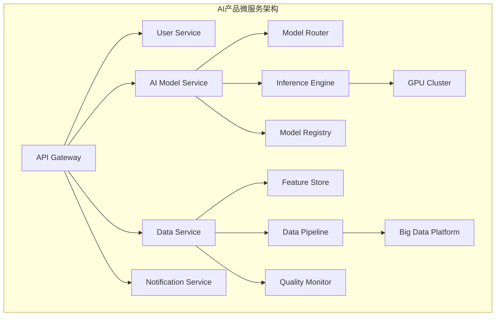

### 模型选择策略

#### 模型选型框架
```bash
# Claude Code模型选型提示词
请帮我选择合适的AI模型：

项目背景：
- 应用场景：[具体场景描述]
- 性能要求：[准确率、延迟、吞吐量]
- 资源限制：[计算资源、存储空间]
- 维护能力：[团队技术栈、运维能力]

候选模型：
1. [模型1及特点]
2. [模型2及特点]
3. [模型3及特点]

请从以下维度进行对比：
- 准确性表现
- 推理速度
- 资源消耗
- 部署复杂度
- 维护成本
- 可扩展性
```

#### 常用模型对比
```yaml
# AI模型选型指南
model_selection_guide:
  computer_vision:
    image_classification:
      lightweight: "MobileNetV3, EfficientNet"
      accurate: "ResNet, ViT"
      real_time: "YOLO, SSD"

    object_detection:
      fast: "YOLOv5, EfficientDet"
      accurate: "Faster R-CNN, DETR"
      edge: "NanoDet, TinyYOLO"

  natural_language:
    text_classification:
      lightweight: "BERT-base, DistilBERT"
      accurate: "RoBERTa, GPT-3"
      multilingual: "XLM-R, mBERT"

    text_generation:
      creative: "GPT-3, Claude"
      controlled: "T5, BART"
      efficient: "GPT-2, DistilGPT"

  recommendation:
    collaborative: "Matrix Factorization, ALS"
    content_based: "TF-IDF, Word2Vec"
    deep_learning: "DeepFM, NCF"
```

### 数据工程架构

#### 数据流水线设计
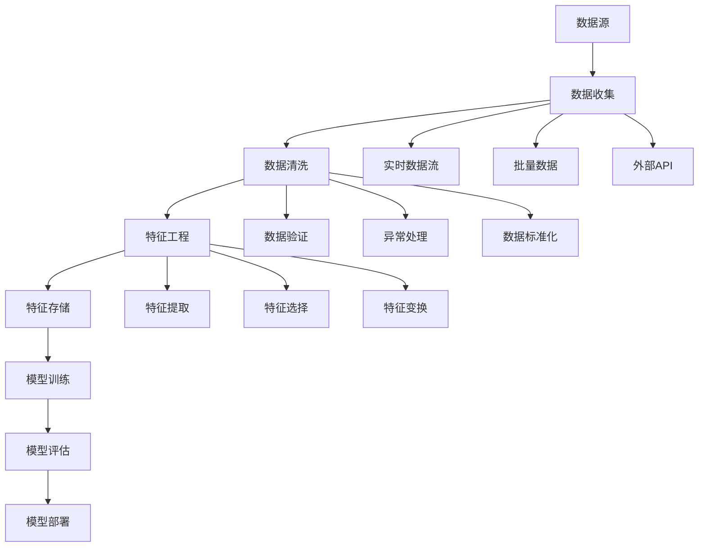

#### 数据质量保障
```yaml
# 数据质量管理
data_quality_management:
  quality_dimensions:
    completeness:
      definition: "数据完整度"
      metrics: "缺失值比例"
      threshold: "<5%"

    accuracy:
      definition: "数据准确性"
      metrics: "错误检测率"
      threshold: "<1%"

    consistency:
      definition: "数据一致性"
      metrics: "格式统一性"
      threshold: "100%"

    timeliness:
      definition: "数据时效性"
      metrics: "数据延迟"
      threshold: "<1小时"

  quality_checks:
    schema_validation:
      - "字段类型检查"
      - "字段长度检查"
      - "必填字段检查"

    business_rules:
      - "数值范围检查"
      - "逻辑关系检查"
      - "业务规则验证"

    statistical_checks:
      - "分布检测"
      - "异常值检测"
      - "趋势分析"
```

## 4. 用户体验优化

### AI产品UX设计原则

#### 透明性设计
```yaml
# AI透明性设计原则
transparency_design:
  model_explanation:
    - "显示预测结果置信度"
    - "提供关键影响因素"
    - "解释决策逻辑"
    - "展示模型能力边界"

  uncertainty_communication:
    - "明确标识不确定性"
    - "提供替代方案"
    - "建议人工审核"
    - "更新频率说明"

  control_and_feedback:
    - "用户可调整参数"
    - "提供反馈机制"
    - "允许纠正错误"
    - "个性化设置"
```

#### 错误处理策略
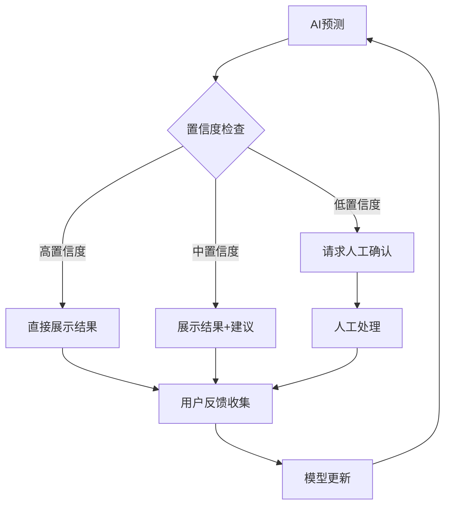

### 界面设计模式

#### AI交互模式
```yaml
# AI产品交互模式
interaction_patterns:
  conversational_ai:
    characteristics:
      - "自然语言对话"
      - "上下文理解"
      - "多轮交互"
    applications:
      - "智能客服"
      - "语音助手"
      - "聊天机器人"

  recommendation_system:
    characteristics:
      - "个性化推荐"
      - "实时更新"
      - "用户反馈学习"
    applications:
      - "商品推荐"
      - "内容推荐"
      - "服务推荐"

  predictive_assistance:
    characteristics:
      - "预测用户需求"
      - "主动提供建议"
      - "减少用户操作"
    applications:
      - "智能搜索"
      - "自动补全"
      - "智能摘要"

  augmented_reality:
    characteristics:
      - "实时信息叠加"
      - "环境理解"
      - "交互式体验"
    applications:
      - "AR导航"
      - "产品试用"
      - "教育培训"
```

### 用户反馈机制

#### 反馈收集策略
```bash
# Claude Code用户反馈分析
请帮我分析AI产品用户反馈：

反馈数据：
[用户评论、评分、使用数据等]

分析维度：
1. 功能满意度
2. 准确性评价
3. 体验问题
4. 改进建议

输出要求：
- 问题分类统计
- 优先级排序
- 具体改进方案
- 预期效果评估
```

#### 反馈闭环设计
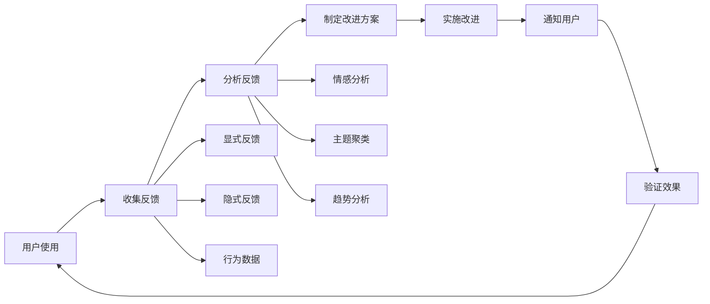

## 5. 数据处理流程

### 数据收集策略

#### 多源数据整合
```yaml
# 数据收集策略
data_collection_strategy:
  user_generated_data:
    types:
      - "用户行为日志"
      - "用户反馈数据"
      - "用户上传内容"
    collection_methods:
      - "前端埋点"
      - "API调用记录"
      - "用户调研"

  external_data:
    types:
      - "公开数据集"
      - "第三方API"
      - "合作伙伴数据"
    considerations:
      - "数据质量评估"
      - "使用权限确认"
      - "更新频率"

  synthetic_data:
    types:
      - "数据增强"
      - "模拟生成"
      - "对抗样本"
    use_cases:
      - "训练数据不足"
      - "隐私保护"
      - "模型鲁棒性测试"
```

#### 数据隐私保护
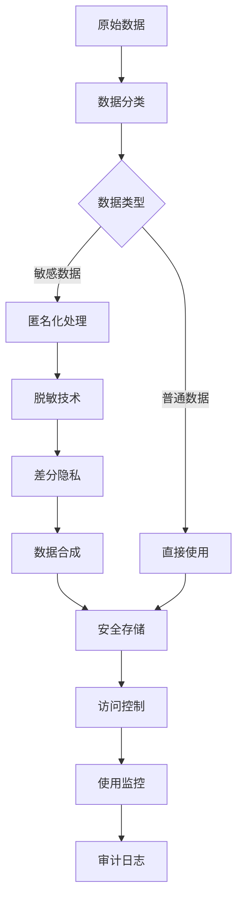

### 特征工程优化

#### 自动化特征工程
```yaml
# 特征工程自动化
automated_feature_engineering:
  feature_generation:
    numerical_features:
      - "多项式特征"
      - "交互特征"
      - "统计特征"
      - "时间序列特征"

    categorical_features:
      - "独热编码"
      - "目标编码"
      - "频率编码"
      - "嵌入编码"

    text_features:
      - "TF-IDF"
      - "词嵌入"
      - "主题模型"
      - "情感特征"

  feature_selection:
    filter_methods:
      - "方差过滤"
      - "相关性分析"
      - "卡方检验"
      - "互信息"

    wrapper_methods:
      - "递归特征消除"
      - "前向选择"
      - "后向消除"

    embedded_methods:
      - "L1正则化"
      - "树模型特征重要性"
      - "神经网络特征选择"
```

### 模型训练优化

#### 训练流程自动化
```bash
# Claude Code训练优化提示词
请帮我优化模型训练流程：

当前训练配置：
[模型架构、超参数、数据集大小等]

优化目标：
- 训练时间缩短
- 模型性能提升
- 资源消耗降低

请提供：
1. 超参数优化建议
2. 训练策略调整
3. 数据处理优化
4. 硬件资源优化
```

#### 分布式训练配置
```yaml
# 分布式训练策略
distributed_training:
  data_parallel:
    description: "数据并行训练"
    framework: "PyTorch DDP, TensorFlow MirroredStrategy"
    use_case: "大批量数据训练"
    benefits: "训练速度线性提升"

  model_parallel:
    description: "模型并行训练"
    framework: "Megatron-LM, DeepSpeed"
    use_case: "超大模型训练"
    benefits: "突破内存限制"

  pipeline_parallel:
    description: "流水线并行训练"
    framework: "GPipe, PipeDream"
    use_case: "多层网络训练"
    benefits: "提高GPU利用率"

  mixed_precision:
    description: "混合精度训练"
    framework: "AMP, FP16"
    benefits: "减少内存占用，加速训练"
    considerations: "数值稳定性"
```

## 6. 模型部署与监控

### 部署架构设计

#### 推理服务架构
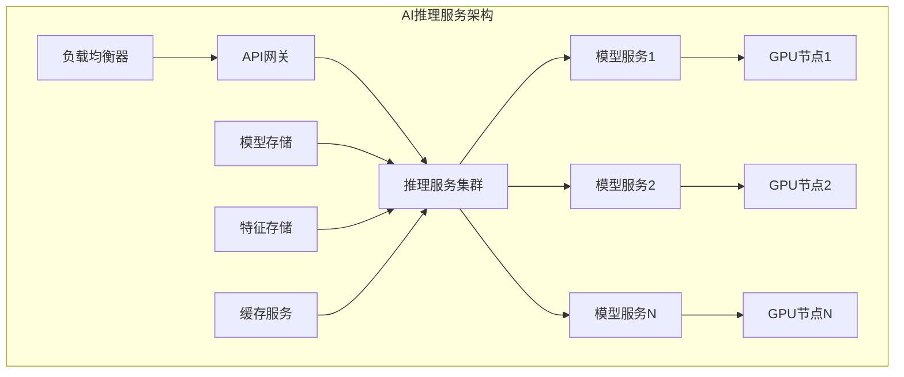

#### 容器化部署
```yaml
# Docker容器化配置
docker_deployment:
  base_image: "nvidia/cuda:11.8-runtime-ubuntu20.04"
  python_version: "3.9"

  dependencies:
    frameworks:
      - "torch==2.0.0"
      - "transformers==4.30.0"
      - "fastapi==0.100.0"
    libraries:
      - "numpy==1.24.0"
      - "pillow==9.5.0"
      - "opencv-python==4.7.0"

  dockerfile_template: |
    FROM nvidia/cuda:11.8-runtime-ubuntu20.04
    RUN apt-get update && apt-get install -y python3.9
    COPY requirements.txt .
    RUN pip install -r requirements.txt
    COPY model/ /app/model/
    COPY app/ /app/app/
    WORKDIR /app
    CMD ["uvicorn", "app.main:app", "--host", "0.0.0.0", "--port", "8000"]
```

### 性能监控体系

#### 监控指标体系
```yaml
# AI模型监控指标
monitoring_metrics:
  performance_metrics:
    latency:
      p50: "50th percentile"
      p95: "95th percentile"
      p99: "99th percentile"
      alert_threshold: "1s"

    throughput:
      requests_per_second: "RPS"
      concurrent_users: "并发用户数"
      alert_threshold: "< 100 RPS"

    accuracy:
      model_accuracy: "模型准确率"
      data_drift: "数据漂移检测"
      concept_drift: "概念漂移检测"
      alert_threshold: "下降>5%"

  resource_metrics:
    gpu_utilization:
      metric: "GPU使用率"
      threshold: "> 90%"

    memory_usage:
      metric: "内存使用率"
      threshold: "> 80%"

    error_rate:
      metric: "错误率"
      threshold: "> 1%"
```

#### 实时监控系统
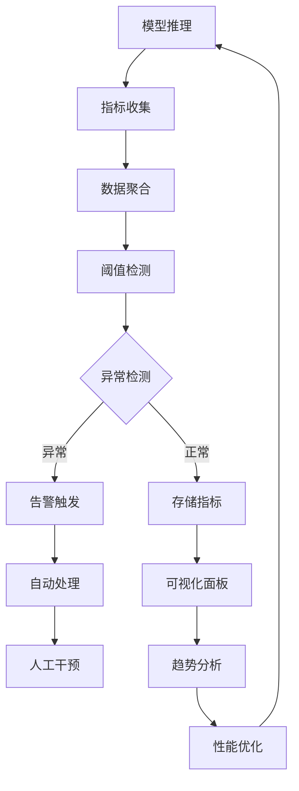

### 模型更新策略

#### 持续学习机制
```yaml
# 持续学习策略
continual_learning:
  online_learning:
    description: "在线实时学习"
    update_frequency: "实时"
    data_requirements: "流式数据"
    advantages: "快速适应变化"
    challenges: "概念漂移处理"

  periodic_retraining:
    description: "定期重训练"
    update_frequency: "每日/每周"
    data_requirements: "累积数据"
    advantages: "稳定可靠"
    challenges: "延迟更新"

  active_learning:
    description: "主动学习"
    update_frequency: "按需"
    data_requirements: "标注优先级"
    advantages: "标注效率高"
    challenges: "样本选择策略"
```

#### A/B测试框架
```bash
# Claude Code A/B测试配置
请帮我设计AI模型A/B测试：

测试目标：
[具体的优化目标]

模型版本：
- 对照组：[基线模型]
- 实验组：[新模型]

流量分配：
- 对照组：50%
- 实验组：50%

评估指标：
1. 业务指标
2. 用户体验指标
3. 系统性能指标

请提供：
- 实验设计方案
- 统计显著性检验
- 风险控制措施
- 决策标准
```

## 7. 商业化与推广

### 商业模式设计

#### AI产品变现模式
```yaml
# AI产品商业模式
business_models:
  saas_model:
    pricing_strategy:
      - "按用户数收费"
      - "按使用量计费"
      - "订阅制收费"
    advantages:
      - "稳定收入流"
      - "客户粘性高"
      - "易于扩展"
    examples:
      - "OpenAI API"
      - "Anthropic Claude"

  api_service:
    pricing_strategy:
      - "按API调用次数"
      - "按数据处理量"
      - "阶梯定价"
    advantages:
      - "弹性计费"
      - "开发者友好"
      - "易于集成"
    examples:
      - "Google Cloud AI"
      - "AWS AI Services"

  enterprise_solution:
    pricing_strategy:
      - "定制化报价"
      - "部署授权费"
      - "维护服务费"
    advantages:
      - "高客单价"
      - "深度合作"
      - "技术壁垒"
    examples:
      - "Palantir"
      - "UiPath"
```

### 市场推广策略

#### 技术营销
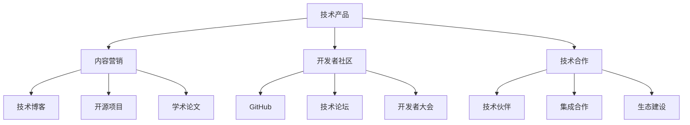

#### 用户增长策略
```yaml
# 用户增长策略
user_growth_strategy:
  acquisition_channels:
    organic:
      - "SEO优化"
      - "内容营销"
      - "口碑传播"

    paid:
      - "搜索广告"
      - "社交媒体广告"
      - "行业展会"

    partnerships:
      - "技术集成伙伴"
      - "渠道合作伙伴"
      - "战略联盟"

  conversion_optimization:
    freemium_model:
      free_features: "基础功能"
      premium_features: "高级AI功能"
      conversion_triggers: "使用限制"

    trial_period:
      duration: "14-30天"
      feature_access: "全部功能"
      conversion_tactics: "使用引导"

  retention_strategies:
    customer_success:
      - "onboarding支持"
      - "最佳实践分享"
      - "定期check-in"

    product_evolution:
      - "功能迭代"
      - "性能优化"
      - "用户反馈响应"
```

## 总结

AI Product Development 通过系统化的方法论，让AI产品从概念到商业化变得可控和高效：

### 🎯 核心要点

1. **产品思维**：以用户价值为中心，技术服务于业务
2. **数据驱动**：建立完整的数据收集、处理、反馈闭环
3. **迭代优化**：持续学习、快速迭代、小步快跑
4. **风险控制**：平衡创新与稳定，管理AI特有的不确定性

### 🚀 成功要素

1. **团队能力**：AI技术+产品设计+商业理解的复合团队
2. **数据优势**：高质量的数据资产和数据处理能力
3. **场景聚焦**：选择合适的应用场景和切入点
4. **生态建设**：构建合作共赢的技术生态

### 💡 关键洞察

- AI产品不是技术的堆砌，而是解决实际问题的工具
- 用户体验和信任度比技术先进性更重要
- 持续的监控和优化是AI产品成功的关键
- 商业化需要找到合适的价值变现模式

通过这套完整的方法论，AI产品开发将更加系统化和专业化，大幅提高成功概率。