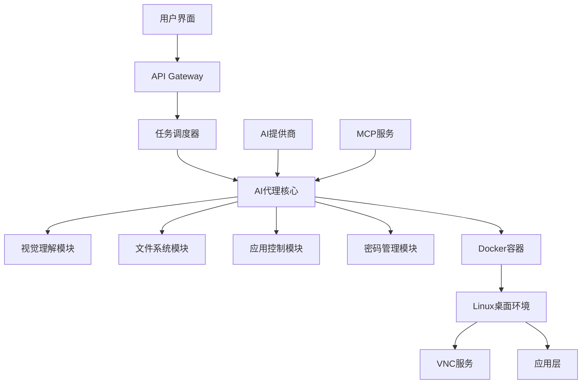

# Bytebot - 开源AI桌面代理

> 让AI拥有自己的电脑的开源桌面代理，通过自然语言命令自动化计算机任务，在容器化的Linux桌面环境中运行

## 📋 目录

1. [项目概述](#1-项目概述)
2. [核心特性](#2-核心特性)
3. [Bytebot vs 传统RPA](#3-bytebot-vs-传统rpa)
4. [多AI提供商支持](#4-多ai提供商支持)
5. [快速开始](#5-快速开始)
6. [架构设计](#6-架构设计)
7. [使用示例](#7-使用示例)
8. [企业级应用](#8-企业级应用)
9. [开发者指南](#9-开发者指南)
10. [安全与隐私](#10-安全与隐私)

## 1. 项目概述

Bytebot 是一个革命性的开源AI桌面代理，它让AI真正拥有了属于自己的电脑。通过在容器化的Linux桌面环境中运行，Bytebot能够理解并执行自然语言命令，自动化各种计算机任务。

### 🎯 设计理念

- **自然语言驱动** - 用人类语言描述任务，无需编程知识
- **真实桌面环境** - 完整的Linux桌面，支持真实应用操作
- **数据主权控制** - 本地部署，数据完全掌控在自己手中
- **企业级RPA替代** - 为企业提供更智能、更灵活的自动化解决方案

## 2. 核心特性

### ✨ 主要功能

- **🖥️ 完整桌面环境** - 真实的Linux桌面环境，支持图形界面应用
- **📁 完整文件系统** - 完整的文件访问权限，可以创建、修改、删除文件
- **🔐 密码管理器集成** - 集成Bitwarden，安全管理登录凭据
- **🔄 跨应用工作流** - 支持多个应用程序间的复杂工作流程
- **📹 实时VNC访问** - 通过VNC实时查看AI操作过程
- **👁️ 视觉理解能力** - 基于视觉识别界面元素，智能交互
- **🐳 容器化隔离** - Docker容器运行，安全隔离不影响宿主机
- **🔌 MCP协议支持** - 支持Model Context Protocol，扩展AI能力

## 3. Bytebot vs 传统RPA

### 核心差异对比

| 特性 | Bytebot | 传统RPA |
|------|---------|---------|
| **编程方式** | 自然语言描述 | 复杂脚本编程 |
| **界面识别** | AI视觉理解 | 严格的元素映射 |
| **适应能力** | 自动适应界面变化 | 需要手动调整 |
| **学习成本** | 几乎为零 | 需要专业培训 |
| **部署成本** | 开源免费 | 商业授权费用高 |
| **数据控制** | 本地部署 | 云端或本地 |
| **扩展性** | AI模型驱动 | 功能有限 |

### 详细对比

#### 🗣️ 自然语言 vs 复杂脚本
```bash
# Bytebot - 自然语言命令
"帮我打开浏览器，搜索最新的AI新闻，然后截图保存到桌面"

# 传统RPA - 复杂脚本
launch_browser()
wait_for_element("#search-box")
input_text("#search-box", "最新AI新闻")
click("#search-button")
wait_for_page_load()
take_screenshot()
save_file("/desktop/screenshot.png")
```

#### 👁️ 视觉理解 vs 元素映射
- **Bytebot**: 通过AI视觉理解界面，自动识别可点击元素
- **传统RPA**: 依赖固定的元素ID、XPath，界面变化即失效

#### 🏢 企业级优势
- **数据主权**: 完全本地部署，数据不出企业网络
- **成本优势**: 开源免费，无授权费用
- **灵活性**: AI驱动，适应各种业务场景

## 4. 多AI提供商支持

Bytebot 支持多个主流AI提供商，用户可以根据需求选择最适合的AI模型

### 🔧 支持的AI提供商

#### Anthropic Claude
- **模型**: Claude-3.5-Sonnet
- **特点**: 强大的推理能力，适合复杂任务
- **优势**: 长上下文支持，处理复杂工作流

#### OpenAI GPT
- **模型**: GPT-4, GPT-4-turbo
- **特点**: 平衡的性能和成本
- **优势**: 广泛的应用生态

#### 本地模型支持
- **Ollama**: 支持本地大语言模型
- **LM Studio**: 本地模型推理
- **优势**: 完全离线运行，数据100%安全

## 5. 快速开始

### 系统要求
- Docker 20.10+
- 4GB+ RAM
- 20GB+ 磁盘空间
- 支持 VNC 的客户端

### 🚀 一键启动

```bash
# 1. 克隆项目
git clone https://github.com/bytebot-org/bytebot.git
cd bytebot

# 2. 配置AI提供商
cp .env.example .env
# 编辑 .env 文件，添加你的API密钥

# 3. 启动服务
docker-compose up -d

# 4. 连接VNC
# VNC地址: localhost:5901
# 密码: bytebot
```

### ⚙️ 环境配置

```bash
# .env 文件配置示例
ANTHROPIC_API_KEY=your_anthropic_api_key
OPENAI_API_KEY=your_openai_api_key
BITWARDEN_CLIENT_ID=your_bitwarden_client_id
BITWARDEN_CLIENT_SECRET=your_bitwarden_client_secret
VNC_PASSWORD=your_vnc_password
```

## 6. 架构设计

### 🏗️ 技术架构



### 核心组件

#### 1. API Gateway (NestJS)
- RESTful API接口
- WebSocket实时通信
- 身份认证和授权
- 请求路由和负载均衡

#### 2. AI代理核心
- 多AI提供商适配
- 自然语言理解
- 任务规划和执行
- 上下文管理

#### 3. 视觉理解模块
- 屏幕截图分析
- 元素识别和定位
- OCR文字识别
- 图像到动作映射

#### 4. 应用控制模块
- 键盘鼠标模拟
- 应用程序启动
- 窗口管理
- 跨应用协调

## 7. 使用示例

### 📝 实际应用场景

#### 场景1: 自动化数据报告
```bash
用户命令: "帮我生成本月销售数据报告"

AI执行流程:
1. 打开Excel应用
2. 连接到数据库
3. 导出本月销售数据
4. 创建数据透视表
5. 生成图表
6. 保存报告到指定位置
```

#### 场景2: 客户服务自动化
```bash
用户命令: "处理今天的客户邮件"

AI执行流程:
1. 打开邮件客户端
2. 筛选未读客户邮件
3. 分析邮件内容
4. 根据模板回复常见问题
5. 标记需要人工处理的邮件
6. 生成处理报告
```

#### 场景3: 系统监控
```bash
用户命令: "检查服务器状态，有问题就告警"

AI执行流程:
1. 打开监控面板
2. 检查各服务器状态
3. 分析异常指标
4. 发送告警通知
5. 生成状态报告
```

### 🔌 MCP扩展

Bytebot支持MCP协议，可以通过插件扩展功能

#### 可用插件
- **Slack插件**: 发送消息到Slack频道
- **邮件插件**: 自动发送邮件
- **数据库插件**: 直接操作数据库
- **API插件**: 调用外部API服务

## 8. 企业级应用

### 🏢 企业场景

#### 财务自动化
- 自动化发票处理
- 财务报表生成
- 预算分析
- 审计准备

#### 人力资源
- 简历筛选
- 入职流程自动化
- 考勤管理
- 培训记录管理

#### 运营管理
- 库存管理
- 订单处理
- 客户关系管理
- 报表生成

### 🔒 企业安全

#### 数据安全
- 本地部署，数据不出企业网络
- 加密存储敏感信息
- 访问权限控制
- 操作审计日志

#### 合规性
- 支持各类合规要求
- 数据处理可追溯
- 权限分离
- 定期安全评估

## 9. 开发者指南

### 🛠️ 开发环境搭建

```bash
# 1. 安装依赖
npm install

# 2. 启动开发环境
npm run dev

# 3. 运行测试
npm run test

# 4. 构建镜像
docker build -t bytebot:latest .
```

### 🔧 自定义开发

#### 添加新的AI提供商
```typescript
// src/ai-providers/custom-provider.ts
export class CustomAIProvider implements AIProvider {
  async processCommand(command: string): Promise<ActionResult> {
    // 实现自定义AI逻辑
  }
}
```

#### 开发自定义插件
```typescript
// src/plugins/custom-plugin.ts
export class CustomPlugin implements MCPPlugin {
  name = 'custom-plugin';

  async executeAction(action: string): Promise<any> {
    // 实现插件功能
  }
}
```

## 10. 安全与隐私

### 🔒 安全特性

#### 容器隔离
- Docker容器完全隔离
- 网络访问控制
- 文件系统权限限制
- 资源使用限制

#### 数据保护
- API密钥加密存储
- 敏感数据内存中处理
- 操作日志脱敏
- 安全的密码管理

#### 访问控制
- JWT身份认证
- 基于角色的权限控制
- 操作审计
- 会话管理

### 🛡️ 隐私保护

#### 本地处理
- 所有处理在本地完成
- 数据不上传到云端
- 支持完全离线模式
- 用户数据完全掌控

#### 透明度
- 开源代码完全可见
- 操作过程可监控
- 日志记录详细
- 用户知情同意

## 📊 项目统计

### 开源信息
- **开发语言**: TypeScript, NestJS
- **容器化**: Docker, Docker Compose
- **协议**: MIT 开源协议
- **社区**: 活跃的开源社区
- **更新频率**: 持续迭代更新

### 性能指标
- **响应时间**: < 2秒（简单任务）
- **并发支持**: 多任务并行处理
- **资源占用**: 可配置资源限制
- **稳定性**: 99.9% 可用性

## 🔗 相关链接

- 📦 [GitHub 仓库](https://github.com/bytebot-org/bytebot)
- 📖 [官方文档](https://docs.bytebot.org)
- 💬 [社区讨论](https://github.com/bytebot-org/bytebot/discussions)
- 🐛 [问题反馈](https://github.com/bytebot-org/bytebot/issues)
- 📧 [联系我们](mailto:hello@bytebot.org)

## 总结

Bytebot 作为下一代AI桌面代理，正在重新定义人机交互的方式：

- **🤖 AI原生设计** - 从底层设计就是为AI服务
- **🗣️ 自然语言交互** - 降低使用门槛，人人可用
- **🏢 企业级可靠性** - 满足企业安全和合规要求
- **🔧 开源可扩展** - 开放架构，支持自定义开发
- **💰 成本效益** - 显著降低自动化成本

无论是个人的日常任务自动化，还是企业的复杂业务流程优化，Bytebot 都能提供强大而灵活的解决方案。开源的特性让用户可以完全掌控自己的数据和工作流程，真正实现AI赋能的智能化办公。