# Onyx - 企业级开源AI平台

> 功能强大的开源AI平台，支持自定义代理、RAG、Web搜索、深度研究、代码解释器等企业级功能

## 📋 目录

1. [项目概述](#1-项目概述)
2. [核心特性](#2-核心特性)
3. [安装指南](#3-安装指南)
4. [功能详解](#4-功能详解)
5. [知识源连接器](#5-知识源连接器)
6. [代理配置](#6-代理配置)
7. [企业级部署](#7-企业级部署)
8. [使用场景](#8-使用场景)
9. [开发者指南](#9-开发者指南)

## 1. 项目概述

Onyx 是一个功能强大的企业级开源AI平台，旨在为组织提供完整的AI解决方案。通过支持多种AI模型、知识源集成和自定义工作流，Onyx帮助企业构建智能化的知识管理和决策支持系统。

### 🎯 设计目标

- **开源可控** - 完全开源，企业可自行部署和控制
- **企业级特性** - 满足企业安全、权限、合规要求
- **高扩展性** - 支持多种AI模型和知识源
- **用户友好** - 精美的UI界面，降低使用门槛

## 2. 核心特性

### ✨ 主要功能

- **🤖 自定义代理** - 创建专门的AI代理处理特定任务
- **🔍 RAG（检索增强生成）** - 基于企业知识库的智能问答
- **🌐 Web 搜索** - 集成实时网络搜索能力
- **📊 深度研究** - 多步骤、多源信息的深度分析
- **⚡ 动作 & MCP** - 支持Model Context Protocol，扩展AI能力
- **💻 代码解释器** - 安全的代码执行环境
- **🔗 40+ 知识源连接器** - 支持各种数据源集成
- **🔒 企业级安全** - 完整的权限管理和安全控制
- **🎨 精美 UI** - 现代化的用户界面设计

## 3. 安装指南

### 🚀 一键安装脚本

```bash
# 下载并运行安装脚本
curl -fsSL https://raw.githubusercontent.com/onyx-project/onyx/main/install.sh | bash

# 或者使用 wget
wget -qO- https://raw.githubusercontent.com/onyx-project/onyx/main/install.sh | bash
```

### 🐳 手动 Docker Compose 部署

#### 1. 克隆项目
```bash
git clone https://github.com/onyx-project/onyx.git
cd onyx
```

#### 2. 配置环境变量
```bash
# 复制配置文件
cp .env.example .env

# 编辑配置
nano .env
```

#### 3. 启动服务
```bash
# 构建并启动
docker-compose up -d

# 查看日志
docker-compose logs -f
```

#### 4. 访问平台
- **Web界面**: http://localhost:3000
- **API文档**: http://localhost:8000/docs

### ⚙️ 环境配置

```bash
# .env 文件示例
# AI模型配置
OPENAI_API_KEY=your_openai_api_key
ANTHROPIC_API_KEY=your_anthropic_api_key

# 数据库配置
POSTGRES_HOST=postgres
POSTGRES_USER=onyx
POSTGRES_PASSWORD=your_secure_password
POSTGRES_DB=onyx

# 向量数据库
QDRANT_URL=http://qdrant:6333

# Web搜索配置
SERPER_API_KEY=your_serper_api_key

# 安全配置
JWT_SECRET=your_jwt_secret
ENCRYPTION_KEY=your_encryption_key
```

## 4. 功能详解

### 🤖 自定义代理

Onyx 支持创建专门的AI代理来处理特定任务和工作流

#### 代理类型
- **知识管理代理** - 专门处理文档检索和知识问答
- **研究助手代理** - 深度研究和分析任务
- **代码助手代理** - 代码生成、解释和调试
- **客服代理** - 基于知识库的客户支持

#### 代理配置示例
```yaml
# 知识管理代理配置
name: "Knowledge Assistant"
description: "专门处理企业知识库查询"
model: "gpt-4"
temperature: 0.1
tools:
  - rag_search
  - document_retrieval
  - web_search
prompts:
  system: "你是一个专业的知识管理助手，基于提供的文档准确回答用户问题"
```

### 🔍 RAG（检索增强生成）

#### 核心能力
- **智能检索** - 基于语义相似度的文档检索
- **上下文增强** - 将检索到的信息作为上下文提供给AI
- **多模态支持** - 支持文本、图片、表格等多种格式
- **实时更新** - 知识库实时更新，AI可以获取最新信息

#### 工作流程

```mermaid
graph LR
    A[用户查询] --> B[向量化检索]
    B --> C[相关文档检索]
    C --> D[上下文构建]
    D --> E[AI生成回答]
    E --> F[结果返回]
```


### 🌐 Web 搜索

#### 搜索引擎集成
- **Google Search** - 通过 Google Search API
- **Bing Search** - Microsoft Bing 搜索
- **Serper** - 高性能搜索API
- **Tavily** - AI优化搜索引擎

#### 搜索功能
- **实时信息** - 获取最新的网络信息
- **多语言支持** - 支持多种语言的搜索
- **搜索过滤** - 可配置搜索来源和时间范围
- **结果摘要** - AI自动总结搜索结果

### 📊 深度研究

#### 多步骤研究
- **信息收集** - 从多个来源收集信息
- **交叉验证** - 验证信息的准确性
- **趋势分析** - 分析数据趋势和模式
- **报告生成** - 自动生成研究报告

#### 研究模板
```yaml
# 市场研究模板
name: "Market Research"
steps:
  - type: web_search
    query: "市场趋势分析"
  - type: data_analysis
    data_source: "market_data.csv"
  - type: report_generation
    format: "markdown"
```

### 💻 代码解释器

#### 安全执行环境
- **沙箱隔离** - 完全隔离的代码执行环境
- **资源限制** - CPU、内存、磁盘使用限制
- **时间限制** - 防止无限循环和长时间运行
- **网络控制** - 可配置的网络访问权限

#### 支持语言
- **Python** - 数据分析、机器学习、科学计算
- **JavaScript** - Web开发、数据处理
- **SQL** - 数据库查询和分析
- **Shell** - 系统管理和文件操作

## 5. 知识源连接器

Onyx 支持 40+ 种知识源，可以轻松集成各种数据源

### 📁 文档类连接器
- **本地文件** - PDF、Word、Excel、PowerPoint
- **云存储** - Google Drive、OneDrive、Dropbox
- **文档管理** - Confluence、Notion、SharePoint
- **知识库** - GitBook、BookStack、Outline

### 🗄️ 数据库连接器
- **关系型数据库** - MySQL、PostgreSQL、SQL Server
- **NoSQL数据库** - MongoDB、Redis、Elasticsearch
- **数据仓库** - Snowflake、BigQuery、Redshift
- **数据湖** - S3、Azure Blob、MinIO

### 🌐 Web连接器
- **网站爬虫** - 静态和动态网站内容
- **API接口** - REST API、GraphQL、SOAP
- **RSS订阅** - 新闻和博客订阅源
- **社交媒体** - Twitter、LinkedIn、Reddit

### 🔧 开发工具
- **代码仓库** - GitHub、GitLab、Bitbucket
- **项目管理** - Jira、Trello、Asana
- **CI/CD** - Jenkins、GitLab CI、GitHub Actions
- **监控工具** - Grafana、Kibana、Datadog

### 配置示例
```yaml
# PostgreSQL 连接器配置
name: "company_database"
type: "postgresql"
connection:
  host: "db.company.com"
  port: 5432
  database: "knowledge_base"
  username: "onyx_user"
  password: "${DB_PASSWORD}"
sync:
  interval: "1h"
  tables: ["documents", "articles", "faqs"]
```

## 6. 代理配置

### 🤖 创建自定义代理

#### 基础配置
```yaml
# 代理配置文件
agent:
  name: "Research Assistant"
  description: "专门处理深度研究任务"

  # AI模型配置
  model:
    provider: "openai"
    model: "gpt-4"
    temperature: 0.2
    max_tokens: 4000

  # 工具配置
  tools:
    - name: "web_search"
      type: "search"
      config:
        engines: ["google", "serper"]
        max_results: 10

    - name: "document_retrieval"
      type: "rag"
      config:
        vector_store: "qdrant"
        top_k: 5
        threshold: 0.7

    - name: "code_interpreter"
      type: "code"
      config:
        languages: ["python", "sql"]
        timeout: 300

  # 系统提示
  system_prompt: |
    你是一个专业的研究助手。在回答问题时：
    1. 首先搜索最新的相关信息
    2. 查阅相关的内部文档
    3. 进行数据分析和验证
    4. 提供详细的研究报告
    5. 注明信息来源和时间
```

#### 高级功能
- **工作流编排** - 多步骤任务自动化
- **条件逻辑** - 基于条件的决策分支
- **错误处理** - 智能错误恢复
- **性能监控** - 代理执行状态监控

## 7. 企业级部署

### 🏢 生产环境部署

#### 高可用架构
```yaml
# docker-compose.prod.yml
version: '3.8'
services:
  onyx-web:
    image: onyxproject/onyx:latest
    replicas: 3
    deploy:
      resources:
        limits:
          cpus: '1.0'
          memory: 2G
    environment:
      - NODE_ENV=production
      - DATABASE_URL=${DATABASE_URL}

  nginx:
    image: nginx:alpine
    ports:
      - "80:80"
      - "443:443"
    volumes:
      - ./nginx.conf:/etc/nginx/nginx.conf
      - ./ssl:/etc/ssl
```

#### 负载均衡配置
```nginx
# nginx.conf
upstream onyx_backend {
    server onyx-web-1:3000;
    server onyx-web-2:3000;
    server onyx-web-3:3000;
}

server {
    listen 443 ssl;
    server_name onyx.company.com;

    ssl_certificate /etc/ssl/cert.pem;
    ssl_certificate_key /etc/ssl/key.pem;

    location / {
        proxy_pass http://onyx_backend;
        proxy_set_header Host $host;
        proxy_set_header X-Real-IP $remote_addr;
    }
}
```

### 🔒 安全配置

#### 身份认证
- **JWT认证** - 基于令牌的身份验证
- **SSO集成** - 支持SAML、OAuth2
- **LDAP/AD** - 企业目录服务集成
- **多因素认证** - 支持2FA

#### 权限控制
```yaml
# 权限配置示例
roles:
  admin:
    permissions:
      - "agent:manage"
      - "user:manage"
      - "data:admin"
      - "system:config"

  researcher:
    permissions:
      - "agent:use"
      - "query:execute"
      - "document:read"

  viewer:
    permissions:
      - "query:execute"
      - "document:read"
```

#### 数据安全
- **加密存储** - 敏感数据加密存储
- **传输加密** - HTTPS/TLS加密传输
- **访问日志** - 完整的访问审计日志
- **数据脱敏** - 敏感信息自动脱敏

## 8. 使用场景

### 💼 企业应用场景

#### 知识管理
- **企业内部知识库** - 整合分散的知识资源
- **智能客服** - 基于知识库的自动问答
- **培训支持** - 新员工培训和知识传递
- **决策支持** - 基于数据的智能决策

#### 研究分析
- **市场研究** - 行业趋势和竞争分析
- **产品研究** - 产品功能和用户反馈分析
- **技术研究** - 前沿技术调研和评估
- **财务分析** - 财务数据分析和预测

#### 开发支持
- **代码助手** - 代码生成和优化建议
- **文档生成** - 自动生成技术文档
- **Bug分析** - 错误日志分析和解决方案
- **架构设计** - 技术架构设计和优化

### 🎯 典型用例

#### 用例1：智能客服系统
```yaml
# 客服代理配置
name: "Customer Service Agent"
knowledge_bases:
  - "product_manual"
  - "faq_database"
  - "support_tickets"
capabilities:
  - answer_questions
  - route_tickets
  - generate_responses
  - sentiment_analysis
```

#### 用例2：研发助手
```yaml
# 研发代理配置
name: "R&D Assistant"
tools:
  - code_interpreter
  - web_search
  - paper_search
  - patent_search
knowledge_bases:
  - "technical_docs"
  - "research_papers"
  - "patent_database"
```

## 9. 开发者指南

### 🛠️ 开发环境搭建

#### 本地开发
```bash
# 1. 克隆项目
git clone https://github.com/onyx-project/onyx.git
cd onyx

# 2. 安装依赖
npm install

# 3. 启动开发环境
npm run dev

# 4. 启动数据库
docker-compose -f docker-compose.dev.yml up -d
```

#### 插件开发
```typescript
// 自定义插件示例
import { Plugin, PluginContext } from '@onyx/plugin-sdk';

export class CustomPlugin implements Plugin {
  name = 'custom-plugin';
  version = '1.0.0';

  async execute(context: PluginContext): Promise<any> {
    const { input, config } = context;

    // 实现插件逻辑
    const result = await this.processData(input, config);

    return result;
  }

  private async processData(data: any, config: any): Promise<any> {
    // 自定义处理逻辑
  }
}
```

### 🔧 API开发

#### RESTful API
```typescript
// 自定义API端点
import { Controller, Get, Post, Body } from '@nestjs/common';

@Controller('api/custom')
export class CustomController {
  @Get('search')
  async search(@Query() query: any) {
    // 实现搜索逻辑
  }

  @Post('process')
  async process(@Body() data: any) {
    // 实现处理逻辑
  }
}
```

#### 扩展AI模型
```typescript
// 自定义AI模型适配器
import { AIModelAdapter } from '@onyx/ai-sdk';

export class CustomModelAdapter extends AIModelAdapter {
  async generateResponse(prompt: string, options: any): Promise<string> {
    // 实现自定义模型调用
  }

  async validateConfig(config: any): Promise<boolean> {
    // 验证配置有效性
  }
}
```

## 📊 项目统计

### 技术栈
- **后端框架**: NestJS (Node.js)
- **数据库**: PostgreSQL + Qdrant (向量数据库)
- **前端**: React + TypeScript
- **部署**: Docker + Docker Compose
- **协议**: MIT 开源协议

### 社区数据
- **GitHub Stars**: 15.2K+
- **贡献者**: 200+
- **活跃用户**: 10K+
- **企业用户**: 500+

## 🔗 相关链接

- 📦 [GitHub 仓库](https://github.com/onyx-project/onyx)
- 📖 [官方文档](https://docs.onyxproject.com)
- 💬 [社区论坛](https://community.onyxproject.com)
- 🎥 [视频教程](https://www.youtube.com/@onyxproject)
- 📧 [技术支持](mailto:support@onyxproject.com)
- 📰 [项目博客](https://blog.onyxproject.com)

## 总结

Onyx 作为企业级开源AI平台，为组织提供了完整、安全、可扩展的AI解决方案：

- **🔓 开源自由** - 完全开源，企业可自主掌控
- **⚡ 功能丰富** - 涵盖RAG、搜索、代码解释器等核心功能
- **🏢 企业就绪** - 满足安全、权限、合规等企业需求
- **🔧 高度可扩展** - 支持自定义代理、插件和AI模型
- **🌐 生态完整** - 40+知识源连接器，支持各种数据集成

无论是在知识管理、研究分析，还是开发支持方面，Onyx都能为企业提供强大而灵活的AI能力，助力数字化转型和智能化升级。